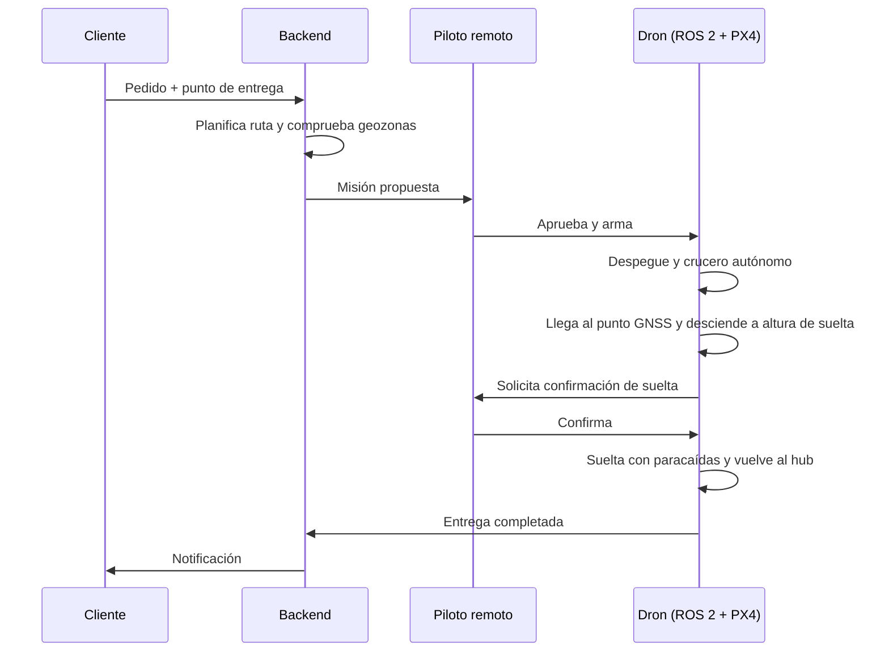
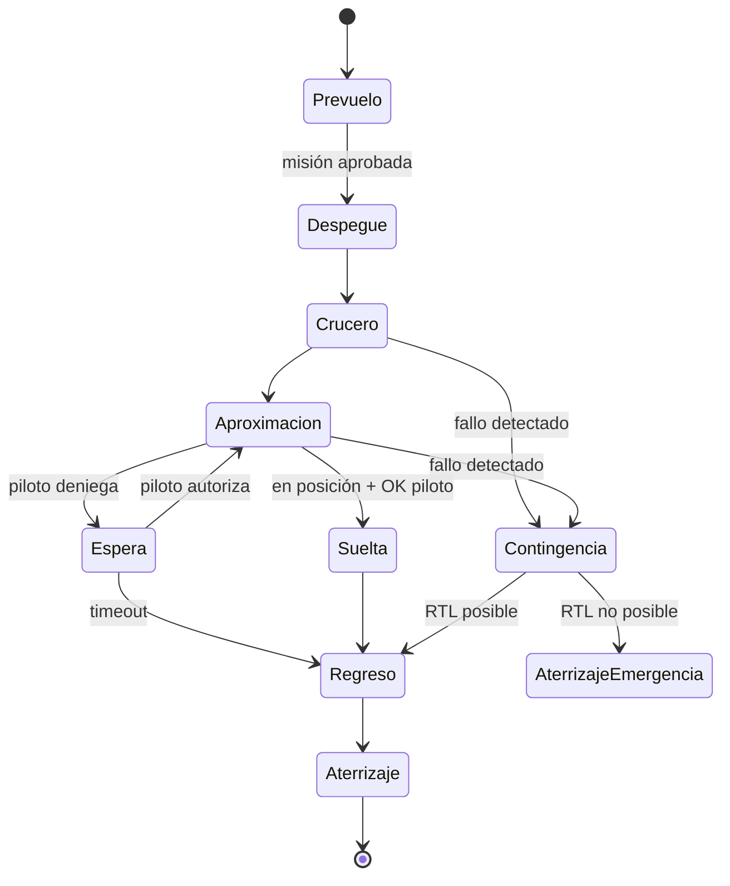

# Dron de reparto urbano (ROS 2 + PX4): documentación

Sep 25, 2026 · @Xabier

## Propósito y alcance

Este paquete documental define, justifica y verifica un dron multirrotor semiautónomo para reparto de última milla en entorno urbano, con PX4 como autopiloto y ROS 2 en el ordenador de a bordo (companion computer).

El enfoque sigue la lógica de ingeniería de sistemas aeronáutica (ARP4754A a escala reducida): concepto de operación → requisitos → arquitectura → seguridad → diseño → verificación. La profundidad de cada documento se ajustará al objetivo real del proyecto (prototipo en simulación, demostrador físico o producto regulado).

## Lista de documentación

Son 14 documentos en 4 fases; los 5 primeros son los que hay que cerrar antes de escribir código serio.

| ID | Documento | Qué contiene | Referencia | Fase |
| --- | --- | --- | --- | --- |
| DOC-01 | ConOps (Concepto de operación) | Misión, actores, escenario urbano, modos de operación, nivel de autonomía, flujo de una entrega | IEEE 1362 / ISO 29148 | 1. Definición |
| DOC-02 | Análisis regulatorio y SORA | Categoría EASA (Specific), SORA 2.5: GRC/ARC, SAIL, OSOs, U-space, requisitos nacionales (DGAC / AESA) | Reg. UE 2019/947, 2019/945, 2021/664 | 1. Definición |
| DOC-03 | Especificación de requisitos del sistema (SRS) | Requisitos funcionales, prestaciones, seguridad, entorno, interfaces; con ID y método de verificación | ISO 29148 / ARP4754A | 1. Definición |
| DOC-04 | Evaluación de seguridad (FHA + PSSA ligera) | Condiciones de fallo, severidad, contingencias (pérdida de enlace, GNSS, batería, motor), geofencing, paracaídas/FTS | ARP4761A / SORA | 1. Definición |
| DOC-05 | Arquitectura del sistema (SAD) | Descomposición HW/SW, reparto PX4 ↔ ROS 2, estación de tierra, nube/flota, diagramas de bloques y de despliegue | ARP4754A / SysML | 2. Diseño |
| DOC-06 | Documento de control de interfaces (ICD) | uXRCE-DDS (tópicos uORB↔ROS 2), MAVLink, API de pedidos, enlace C2, mecanismo de entrega | — | 2. Diseño |
| DOC-07 | Diseño de software ROS 2 | Nodos, tópicos, servicios, acciones, máquina de estados de misión, gestión de lifecycle, QoS | ROS 2 / REP | 2. Diseño |
| DOC-08 | Especificación hardware y presupuestos | Airframe, motores, batería, sensores, companion computer; presupuestos de masa, potencia, autonomía y enlace | — | 2. Diseño |
| DOC-09 | Plan de gestión de configuración y desarrollo | Repos, ramas, versiones de PX4/ROS 2, CI, parámetros PX4 bajo control, estándar de código | Inspirado en DO-178C (SCMP/SDP) | 3. Ejecución |
| DOC-10 | Plan de simulación (SITL/HITL) | Gazebo, mundos urbanos, escenarios nominales y de fallo, criterios de paso | — | 3. Ejecución |
| DOC-11 | Plan y procedimientos de verificación | Matriz de trazabilidad requisito → prueba, campañas SIL/HIL/vuelo | ARP4754A | 3. Ejecución |
| DOC-12 | Manual de operaciones (OM) y procedimientos de emergencia | Checklists, roles del piloto remoto, límites operativos, mantenimiento | Requisito SORA (OSO) | 4. Operación |
| DOC-13 | Plan de proyecto y registro de riesgos | Hitos, presupuesto, riesgos técnicos/regulatorios/negocio | — | Transversal |
| DOC-14 | Registro de decisiones (ADR) | Decisiones de arquitectura con alternativas y motivo | — | Transversal |

Como el proyecto sigue ARP4754A, DOC-09 se amplía al juego de planes que pide la norma (§5.0 y apéndices): Plan de desarrollo, Plan del programa de seguridad, Plan de validación de requisitos, Plan de verificación, Plan de gestión de configuración y Plan de aseguramiento de proceso. Están en la pestaña DOC-09 Planes.

## DOC-01 ConOps (borrador v0.1)

Un multirrotor de menos de 4 kg lleva hasta 1 kg desde un hub a un punto a ≤5 km, suelta el paquete con paracaídas sobre una zona de entrega y vuelve, todo en modo autónomo bajo supervisión de un piloto remoto que puede intervenir en cualquier momento.

### 1. Misión y objetivo del proyecto

- **Misión:** reparto de paquetería ligera (farmacia, comida, recambios) en última milla urbana.
- **Objetivo del proyecto:** aprendizaje. Se desarrolla y valida principalmente en simulación (PX4 SITL + Gazebo + ROS 2); un prototipo físico es opcional y volaría solo en entorno controlado.
- **Fuera de alcance:** operación comercial real, certificación, entrega a personas en mano.

**Fases del proyecto**

| Fase | Alcance | Plataforma |
| --- | --- | --- |
| 1 | Un dron + estación de tierra; misión cargada desde la GCS | Simulación (SITL), luego hardware real |
| 2 | Gestión de varios drones (flota, deconflicción, U-space) | Simulación multi-vehículo |
| 3 | Sistema de pedidos (cliente, backend, planificación) | Backend + simulación |

Escenario de referencia: Toulouse. La operación se parametriza (geozonas, hub, mapas, elevaciones) para poder reutilizarla en otras ciudades sin cambiar código.

### 2. Actores

| Actor | Rol |
| --- | --- |
| Cliente | Hace el pedido y define el punto de entrega (app/API simulada) |
| Operador del hub | Carga el paquete, cambia batería, hace la inspección prevuelo |
| Piloto remoto (supervisor) | Aprueba la misión, supervisa en la GCS (QGroundControl), puede pausar, desviar, forzar RTL o aterrizaje |
| Gestor de misiones (backend) | Fase 3. En fase 1 la misión se carga desde la GCS |
| Servicio U-space (simulado) | Fase 2. Autorización de vuelo, geozonas, tráfico cercano |
| Dron | Ejecuta la misión: PX4 vuela, ROS 2 decide |

### 3. Escenario operativo

| Parámetro | Valor objetivo |
| --- | --- |
| Carga útil | ≤1 kg, volumen aprox. 25 × 20 × 10 cm |
| MTOM del dron | <4 kg |
| Radio de operación | 5 km desde el hub (ida y vuelta 10 km + 20 % reserva) |
| Altura de crucero | 60–100 m AGL (máx. 120 m) |
| Velocidad de crucero | \~12 m/s (≈7 min por trayecto) |
| Altura de suelta | 15–25 m AGL (a validar con el paracaídas) |
| Viento máx. operativo | 8 m/s sostenido, ráfagas 11 m/s |
| Condiciones | Día, VMC, sin lluvia |
| Tipo de vuelo | BVLOS, un piloto por dron (1:1) |

### 4. Flujo de una entrega

La suelta es el único punto con confirmación humana obligatoria; el resto lo decide el dron salvo intervención. Sin cámara en v1, el punto de entrega es una coordenada GNSS dentro de una zona de suelta predefinida y reconocida de antemano; el piloto confirma con la telemetría (posición, altura, viento).

### 5. Modos de operación

Contingencias previstas: pérdida de enlace C2, pérdida o degradación de GNSS, batería baja/crítica, salida de geofence, fallo del companion computer, fallo de motor. Cada una se detallará en DOC-04.

### 6. Reparto de responsabilidades a bordo

| Capa | Responsabilidad |
| --- | --- |
| PX4 (FMU) | Estabilización, navegación, modos de vuelo, failsafes básicos (RTL, land, geofence, batería). Debe ser seguro aunque ROS 2 caiga |
| ROS 2 (companion) | Gestión de misión, máquina de estados, control en modo Offboard, percepción de zona de entrega, control del mecanismo de suelta, telemetría al backend |
| Puente | uXRCE-DDS (tópicos uORB ↔ ROS 2) |
| Tierra | QGroundControl (MAVLink) para el piloto; backend para misiones |

Principio de diseño: PX4 es la autoridad final de seguridad; ROS 2 propone, PX4 dispone.

## Supuestos y preguntas abiertas

El riesgo técnico principal es la suelta con paracaídas: con 8 m/s de viento, un paquete de 1 kg soltado a 20 m puede derivar decenas de metros, lo que obliga a zonas de entrega amplias o a compensar la deriva.

**Supuestos de trabajo (v0.1)**

- Proyecto de aprendizaje: DOC-02 (regulación) y DOC-12 (operaciones) se hacen como análisis "como si", no como solicitud real.
- En la UE soltar objetos no está permitido en categoría Abierta; una operación BVLOS urbana con suelta sería categoría Específica con SORA.
- Stack: PX4 v1.17 , ROS 2 Jazzy, Gazebo Harmonic, uXRCE-DDS, QGroundControl.
- Una sola aeronave (1:1); la gestión de flota queda fuera de v1.

**Decisiones tomadas (25/09/2026)**

| # | Tema | Decisión |
| --- | --- | --- |
| D1 | Plataforma | Objetivo: llegar a hardware real. Componentes por decidir (estudio de alternativas en DOC-08 / ADR) |
| D2 | Escenario | Toulouse como referencia; sistema parametrizable para otras ciudades |
| D3 | Punto de entrega | Coordenada GNSS, sin marcador visual |
| D4 | Percepción | Sin cámara en v1 |
| D5 | Alcance por fases | Fase 1 dron + tierra, fase 2 multi-dron, fase 3 pedidos |
| D6 | Rigor | Proceso completo según ARP4754A (y ARP4761A para seguridad), sin certificación real |
| D7 | Terminación de vuelo | Solo FTS (corte de motores), sin paracaídas de aeronave |
| D8 | Escala de severidad | MOC Light-UAS.2510 de EASA |
| D9 | Herramientas | Híbrido: requisitos y trazabilidad en Git con Doorstop + arquitectura en Eclipse Papyrus (SysML 1.6) |
| D10 | Presupuesto HW | Menos de 1.000 € para el prototipo |

**Pendiente para más adelante (backlog)**

- [ ] Cámara para verificar zona libre antes de la suelta (y aterrizaje de precisión)
- [ ] Gestión multi-dron y U-space (fase 2)
- [ ] Sistema de pedidos (fase 3)
- [ ] Selección de componentes hardware

## Análisis funcional a nivel aeronave (borrador v0.1)

Siguiendo ARP4754A, el siguiente paso tras el ConOps es fijar las funciones de la aeronave en fase 1. Estas funciones alimentan la FHA de aeronave (DOC-04) y los requisitos de alto nivel (DOC-03), y se asignan a sistemas más tarde, en DOC-05.

| ID | Función | Descripción | Fase |
| --- | --- | --- | --- |
| F1 | Volar de forma controlada | Generar sustentación y empuje; controlar actitud y altura | 1 |
| F2 | Navegar | Estimar posición, velocidad y actitud; seguir la ruta planificada | 1 |
| F3 | Gestionar la misión | Cargar, validar y secuenciar las fases de la misión (despegue → suelta → regreso) | 1 |
| F4 | Comunicar con tierra | Enlace C2: telemetría hacia tierra, comandos hacia el dron | 1 |
| F5 | Transportar y liberar la carga | Retener el paquete en vuelo; soltarlo solo cuando se ordena; desplegar su paracaídas | 1 |
| F6 | Contener y proteger la operación | Geofence, detección de fallos, contingencias (RTL, aterrizaje, espera) | 1 |
| F7 | Gestionar la energía | Supervisar batería; estimar autonomía restante frente a la necesaria para volver | 1 |
| F8 | Permitir la supervisión humana | Mostrar estado al piloto; permitir pausa, desvío, RTL, aterrizaje o terminación | 1 |
| F9 | Limitar el daño en caso de pérdida de control | Terminación de vuelo (FTS) por corte de motores, independiente del autopiloto | 1 |
| F10 | Coordinarse con otras aeronaves y U-space | Deconflicción, intercambio de intenciones | 2 |
| F11 | Recibir y planificar pedidos | Interfaz con el sistema de pedidos | 3 |

**Escala para la FHA (D8): se usa** la escala de severidad del MOC Light-UAS.2510 de EASA (Catastrófico / Peligroso / Mayor / Menor, definidos por el efecto en terceros en tierra y en aire). Encaja mejor con un UAS que la escala CS-25 y es coherente con SORA.

## DOC-04 FHA de aeronave (borrador v0.1)

De 12 condiciones de fallo iniciales, 4 salen catastróficas y todas llevan a lo mismo: la aeronave cae o se escapa sobre zona poblada. Sin paracaídas (D7), la protección tiene que venir de la contención, del FTS y de planificar rutas que no sobrevuelen multitudes.

**Escala de severidad (resumen de trabajo; cotejar con el texto oficial del MOC Light-UAS.2510)**

| Severidad | Efecto principal |
| --- | --- |
| Catastrófico | Posible fatalidad de terceros (en tierra o en aire) |
| Peligroso | Posibles lesiones graves a terceros, o gran reducción de los márgenes de seguridad |
| Mayor | Reducción significativa de márgenes o aumento importante de la carga del piloto remoto; lesiones leves posibles |
| Menor | Ligera reducción de márgenes; sin lesiones |

**Orden de magnitud del peligro:** a 4 kg y 12 m/s la energía cinética ronda los 290 J; en caída libre desde 100 m, con velocidad terminal estimada de 20–25 m/s, pasa de 800 J. Ambos valores superan de sobra el umbral de 80 J que usa la normativa europea como referencia de riesgo para personas.

| ID | Función | Condición de fallo | Fase de vuelo | Efecto | Severidad propuesta | Mitigación inicial |
| --- | --- | --- | --- | --- | --- | --- |
| FC-01 | F1 | Pérdida de control en vuelo | Todas | Caída incontrolada sobre terceros | Catastrófico | Diseño de propulsión con margen; FTS; rutas sobre zonas de baja densidad |
| FC-02 | F2 | Posición errónea no detectada | Crucero | Salida de la zona operacional sin que nadie lo sepa | Peligroso | Monitorización de integridad EKF2; geofence con fuente independiente |
| FC-03 | F2 | Pérdida de GNSS detectada | Crucero / aproximación | Contingencia, aterrizaje en zona no prevista | Mayor | Failsafe PX4 de pérdida de GNSS; puntos de aterrizaje de emergencia |
| FC-04 | F4 | Pérdida del enlace C2 detectada | Todas | Sin supervisión; el dron hace RTL | Mayor | Failsafe de pérdida de enlace; enlace redundante (radio + LTE) a estudiar |
| FC-05 | F5 | Suelta de carga no ordenada | Crucero | Paquete de 1 kg cae sobre terceros | Peligroso | Retención con doble condición (orden + estado de misión); inhibición fuera de la zona de suelta |
| FC-06 | F5 | Paracaídas del paquete no se abre | Suelta | Impacto del paquete a alta velocidad | Peligroso | Zona de suelta sin personas; altura mínima de suelta; ensayos del sistema de paracaídas |
| FC-07 | F5 | Carga no liberada | Suelta | Regreso con carga; misión fallida | Menor | Detección de carga retenida; margen de batería para volver con carga |
| FC-08 | F6 | Pérdida de contención (fly-away) | Todas | Aeronave fuera de control fuera de la zona | Catastrófico | Geofence en PX4 + FTS independiente con disparo automático al cruzar el límite exterior |
| FC-09 | F7 | Estimación de batería errónea | Crucero / regreso | Aterrizaje forzoso en zona no controlada | Peligroso | Estimación por energía consumida + tensión; reserva mínima del 20 % |
| FC-10 | F8 | El piloto no puede intervenir (fallo de GCS) | Todas | El dron sigue en autónomo sin supervisión | Mayor | Tratar como pérdida de C2; GCS de respaldo |
| FC-11 | F9 | Disparo del FTS no ordenado | Todas | Caída incontrolada | Catastrófico | Armado del FTS con doble acción; lógica de disparo simple y verificable |
| FC-12 | F9 | FTS no actúa cuando se ordena | Emergencia | Se pierde la última barrera ante un fly-away | Catastrófico (combinado con FC-08) | Alimentación y receptor independientes; prueba de FTS en cada prevuelo |

Nota de arquitectura: el companion ROS 2 no aparece como fuente directa de condiciones catastróficas si PX4 mantiene la autoridad final (ConOps §6). Su fallo cae en FC-03/FC-10 como mucho. Esto conviene preservarlo en la arquitectura, porque permite asignar un DAL menor al software ROS 2 que a PX4 y al FTS.

**Siguientes pasos de la FHA:** asignar DAL de función según ARP4754A Tabla 5-2; derivar los primeros requisitos de seguridad (DOC-03); decidir si en Toulouse las rutas siguen corredores de baja densidad (Garona, canal del Midi, vías férreas).
