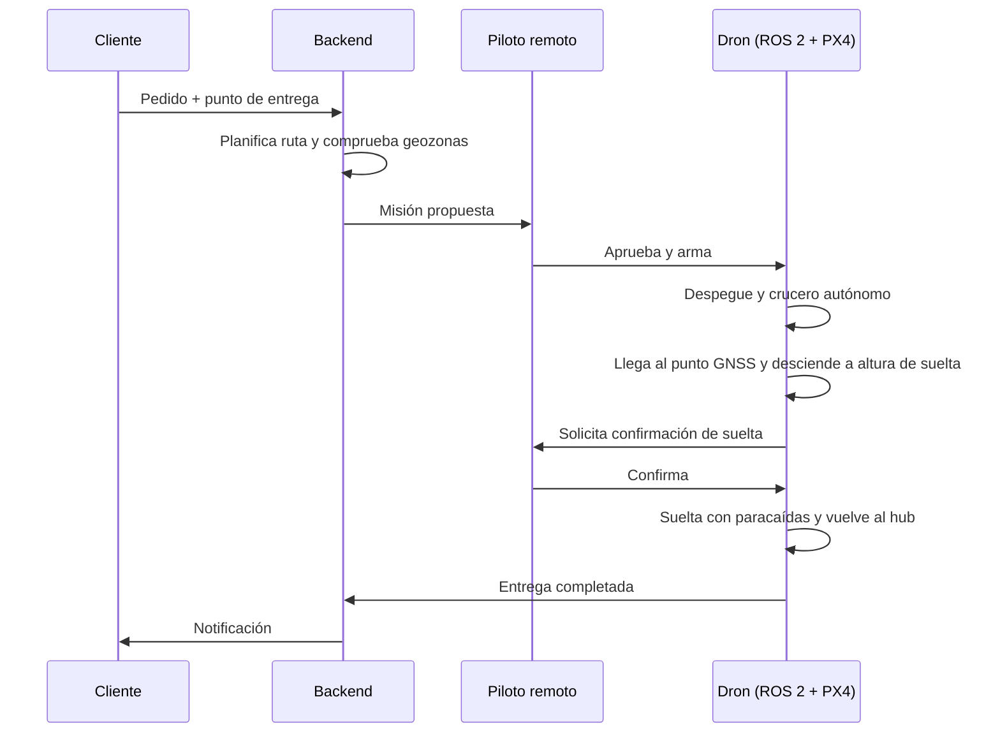
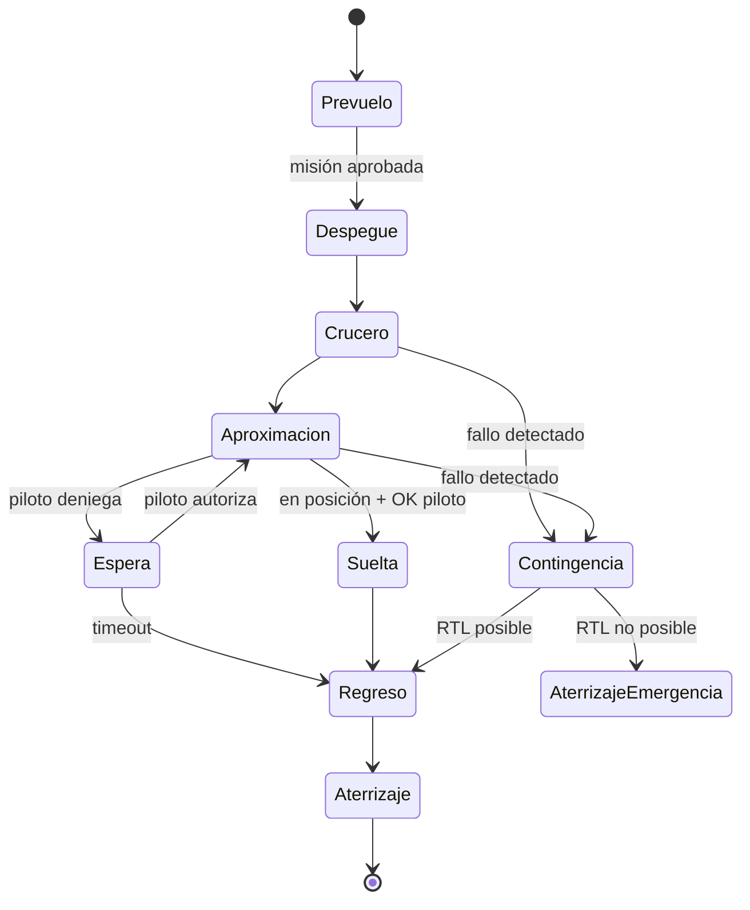

# DOC-01 ConOps (borrador v0.1)

Sep 25, 2026 · @Xabier · extraído del índice el 30/09/2026 sin cambios de contenido

Un multirrotor de menos de 4 kg lleva hasta 1 kg desde un hub a un punto a ≤5 km, suelta el paquete con paracaídas sobre una zona de entrega y vuelve, todo en modo autónomo bajo supervisión de un piloto remoto que puede intervenir en cualquier momento.

## 1. Misión y objetivo del proyecto

- **Misión:** reparto de paquetería ligera (farmacia, comida, recambios) en última milla urbana.
- **Objetivo del proyecto:** aprendizaje. Se desarrolla y valida principalmente en simulación (PX4 SITL + Gazebo + ROS 2); un prototipo físico es opcional y volaría solo en entorno controlado.
- **Fuera de alcance:** operación comercial real, certificación, entrega a personas en mano.

**Fases del proyecto**

| Fase | Alcance | Plataforma |
| --- | --- | --- |
| 1 | Un dron + estación de tierra; misión cargada desde la GCS | Simulación (SITL), luego hardware real |
| 2 | Gestión de varios drones (flota, deconflicción, U-space) | Simulación multi-vehículo |
| 3 | Sistema de pedidos (cliente, backend, planificación) | Backend + simulación |

Escenario de referencia: Toulouse. La operación se parametriza (geozonas, hub, mapas, elevaciones) para poder reutilizarla en otras ciudades sin cambiar código.

## 2. Actores

| Actor | Rol |
| --- | --- |
| Cliente | Hace el pedido y define el punto de entrega (app/API simulada) |
| Operador del hub | Carga el paquete, cambia batería, hace la inspección prevuelo |
| Piloto remoto (supervisor) | Aprueba la misión, supervisa en la GCS (QGroundControl), puede pausar, desviar, forzar RTL o aterrizaje |
| Gestor de misiones (backend) | Fase 3. En fase 1 la misión se carga desde la GCS |
| Servicio U-space (simulado) | Fase 2. Autorización de vuelo, geozonas, tráfico cercano |
| Dron | Ejecuta la misión: PX4 vuela, ROS 2 decide |

## 3. Escenario operativo

| Parámetro | Valor objetivo |
| --- | --- |
| Carga útil | ≤1 kg, volumen aprox. 25 × 20 × 10 cm |
| MTOM del dron | <4 kg |
| Radio de operación | 5 km desde el hub (ida y vuelta 10 km + 20 % reserva) |
| Altura de crucero | 60–100 m AGL (máx. 120 m) |
| Velocidad de crucero | \~12 m/s (≈7 min por trayecto) |
| Altura de suelta | 15–25 m AGL (a validar con el paracaídas) |
| Viento máx. operativo | 8 m/s sostenido, ráfagas 11 m/s |
| Condiciones | Día, VMC, sin lluvia |
| Tipo de vuelo | BVLOS, un piloto por dron (1:1) |

## 4. Flujo de una entrega

La suelta es el único punto con confirmación humana obligatoria; el resto lo decide el dron salvo intervención. Sin cámara en v1, el punto de entrega es una coordenada GNSS dentro de una zona de suelta predefinida y reconocida de antemano; el piloto confirma con la telemetría (posición, altura, viento).

## 5. Modos de operación

Contingencias previstas: pérdida de enlace C2, pérdida o degradación de GNSS, batería baja/crítica, salida de geofence, fallo del companion computer, fallo de motor. Cada una está en DOC-04 (FHA v0.2): pérdida de C2 (FC-04), GNSS (FC-02, FC-03), batería (FC-09, FC-14), geofence (FC-08), companion (FC-15, FC-16) y motor (FC-13).

## 6. Reparto de responsabilidades a bordo

| Capa | Responsabilidad |
| --- | --- |
| PX4 (FMU) | Estabilización, navegación, modos de vuelo, failsafes básicos (RTL, land, geofence, batería). Debe ser seguro aunque ROS 2 caiga |
| ROS 2 (companion) | Gestión de misión, máquina de estados, control en modo Offboard, percepción de zona de entrega, control del mecanismo de suelta, telemetría al backend |
| Puente | uXRCE-DDS (tópicos uORB ↔ ROS 2) |
| Tierra | QGroundControl (MAVLink) para el piloto; backend para misiones |

Principio de diseño: PX4 es la autoridad final de seguridad; ROS 2 propone, PX4 dispone.

## Análisis funcional a nivel aeronave (borrador v0.1)

Siguiendo ARP4754A, el siguiente paso tras el ConOps es fijar las funciones de la aeronave en fase 1. Estas funciones alimentan la FHA de aeronave (DOC-04) y los requisitos de alto nivel (DOC-03), y se asignan a sistemas más tarde, en DOC-05.

| ID | Función | Descripción | Fase |
| --- | --- | --- | --- |
| F1 | Volar de forma controlada | Generar sustentación y empuje; controlar actitud y altura | 1 |
| F2 | Navegar | Estimar posición, velocidad y actitud; seguir la ruta planificada | 1 |
| F3 | Gestionar la misión | Cargar, validar y secuenciar las fases de la misión (despegue → suelta → regreso) | 1 |
| F4 | Comunicar con tierra | Enlace C2: telemetría hacia tierra, comandos hacia el dron | 1 |
| F5 | Transportar y liberar la carga | Retener el paquete en vuelo; soltarlo solo cuando se ordena; desplegar su paracaídas | 1 |
| F6 | Contener y proteger la operación | Geofence, detección de fallos, contingencias (RTL, aterrizaje, espera) | 1 |
| F7 | Gestionar la energía | Supervisar batería; estimar autonomía restante frente a la necesaria para volver | 1 |
| F8 | Permitir la supervisión humana | Mostrar estado al piloto; permitir pausa, desvío, RTL, aterrizaje o terminación | 1 |
| F9 | Limitar el daño en caso de pérdida de control | Terminación de vuelo (FTS) por corte de motores, independiente del autopiloto | 1 |
| F10 | Coordinarse con otras aeronaves y U-space | Deconflicción, intercambio de intenciones | 2 |
| F11 | Recibir y planificar pedidos | Interfaz con el sistema de pedidos | 3 |

**Escala para la FHA (D8): se usa** la escala de severidad del MOC Light-UAS.2510 de EASA (Catastrófico / Peligroso / Mayor / Menor, definidos por el efecto en terceros en tierra y en aire). Encaja mejor con un UAS que la escala CS-25 y es coherente con SORA.

