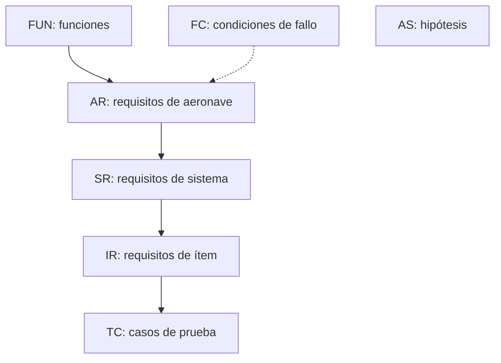

# DOC-03 Requisitos de aeronave (borrador v0.1)

Sep 25, 2026 · @Xabier

## 1. Asignación de FDAL

Tres funciones salen FDAL A: control del vuelo (F1), contención (F6) y terminación (F9). PX4 es código abierto sin evidencias DO-178C, así que no puede declararse DAL A por sí solo; el DAL A se alcanza por arquitectura, repartiendo la función entre miembros independientes.

| Función | Peor condición de fallo | Severidad | FDAL (Tabla 5-2) | Implementación prevista |
| --- | --- | --- | --- | --- |
| F1 Volar de forma controlada | FC-01 | Catastrófico | A | PX4 + FTS como barrera independiente |
| F2 Navegar | FC-02 | Peligroso | B | PX4 (EKF2) con monitorización de integridad |
| F3 Gestionar la misión | Sin FC catastrófica si PX4 mantiene la autoridad | Mayor | C | Companion ROS 2 |
| F4 Comunicar con tierra | FC-04 | Mayor | C | Enlace C2 + failsafe PX4 |
| F5 Transportar y liberar la carga | FC-05, FC-06 | Peligroso | B | Dos miembros C: payload\_manager (ROS 2) ordena y drop\_guard (PX4) autoriza (ADR-007) |
| F6 Contener la operación | FC-08 | Catastrófico | A | Geofence PX4 + FTS con geofence propio |
| F7 Gestionar la energía | FC-09 | Peligroso | B | PX4 (estimación y failsafe de batería) |
| F8 Permitir la supervisión humana | FC-10 | Mayor | C | QGroundControl + RC de seguridad |
| F9 Limitar el daño | FC-11, FC-12 | Catastrófico | A | FTS independiente |

**Descomposición propuesta para F6 y F9 (ARP4754A Tabla 5-3):** dos miembros independientes, geofence de PX4 y FTS con su propio GNSS y alimentación, cada uno con DAL B. La independencia la tiene que demostrar la CCA (§2 de los planes).

**Provisional:** estos niveles salen de la tabla general de ARP4754A. Si el MOC Light-UAS.2510 permite niveles más bajos para esta clase de UAS, se revisarán con un ADR.

## 2. Requisitos de aeronave

Son 20 requisitos iniciales: 6 de misión y prestaciones, 9 de seguridad derivados de la FHA y 5 de supervisión y soporte. Los valores entre corchetes \[TBD-n\] están pendientes (§3). Métodos: I = Inspección, A = Análisis, D = Demostración, T = Ensayo.

**Misión y prestaciones**

| ID | Requisito | Padre | FDAL | Verif. |
| --- | --- | --- | --- | --- |
| AR-001 | La aeronave deberá transportar una carga útil de hasta 1,0 kg y 25 × 20 × 10 cm. | F5, ConOps §3 | B | T |
| AR-002 | La masa máxima al despegue deberá ser inferior a 4,0 kg. | ConOps §3 | — | I |
| AR-003 | Objetivo de sistema: la aeronave deberá completar una misión de 5 km de radio con carga máxima y aterrizar con al menos el 20 % de energía disponible (en fase 1 se valida en simulación). Límite del prototipo de fase 1 (ADR-009): al menos 1,5 km de radio en las mismas condiciones. | F7, ConOps §3 | B | A, T |
| AR-004 | La aeronave deberá cumplir la misión con viento sostenido de hasta 8 m/s y ráfagas de hasta 11 m/s. | F1, ConOps §3 | A | A, T |
| AR-005 | La aeronave no deberá superar 120 m AGL en ninguna fase de vuelo. | F6, reglamento | A | T |
| AR-006 | La aeronave deberá ejecutar la misión completa (despegue, crucero, aproximación, suelta, regreso, aterrizaje) sin intervención del piloto, salvo la confirmación de suelta. | F3, ConOps §4 | C | D, T |

**Seguridad (derivados de la FHA)**

| ID | Requisito | Padre | FDAL | Verif. |
| --- | --- | --- | --- | --- |
| AR-007 | La carga solo deberá liberarse tras una confirmación explícita del piloto remoto. | FC-05 | B | T |
| AR-008 | La carga no deberá liberarse fuera del volumen de suelta definido para la misión, aunque se reciba la orden. | FC-05 | B | A, T |
| AR-009 | La aeronave deberá detectar que la carga no se ha liberado y notificarlo al piloto en menos de \[TBD-1\] s. | FC-07 | C | T |
| AR-010 | La aeronave deberá permanecer dentro del volumen operacional aprobado y aplicar una contingencia al alcanzar su límite. | FC-08 | A | A, T |
| AR-011 | La aeronave deberá disponer de un FTS que termine el vuelo por orden del piloto o automáticamente al salir del volumen de contingencia, independiente del autopiloto. | FC-08, FC-12 | A | A, T |
| AR-012 | El FTS no deberá activarse sin una orden del piloto o una condición de disparo definida. | FC-11 | A | A, T |
| AR-013 | Ante la pérdida del enlace C2 durante más de \[TBD-2\] s, la aeronave deberá ejecutar la contingencia predefinida para la fase de vuelo. | FC-04 | C | T |
| AR-014 | La aeronave deberá detectar la pérdida o degradación de la solución de navegación y ejecutar una contingencia en menos de \[TBD-3\] s. | FC-02, FC-03 | B | A, T |
| AR-015 | La aeronave deberá estimar de forma continua la energía necesaria para volver e iniciar el regreso o el aterrizaje cuando la energía restante alcance ese valor más la reserva. | FC-09 | B | A, T |

**Supervisión y soporte**

| ID | Requisito | Padre | FDAL | Verif. |
| --- | --- | --- | --- | --- |
| AR-016 | El segmento de tierra deberá mostrar al piloto posición, altura, fase de misión, estado de energía y calidad del enlace, con refresco de al menos 1 Hz. | F8 | C | D |
| AR-017 | El piloto deberá poder, en cualquier fase, pausar la misión, ordenar regreso, ordenar aterrizaje o activar el FTS. | F8, FC-10 | C | T |
| AR-018 | Un fallo del computador de misión no deberá impedir que la aeronave ejecute una contingencia segura. | ConOps §6, FC-03, FC-10 | B | A, T |
| AR-019 | La configuración de la operación (hub, geozonas, volumen operacional, zonas de suelta) deberá poder cambiarse sin modificar el código. | D2 | — | I, D |
| AR-020 | La aeronave deberá registrar los datos de vuelo y los eventos de misión para el análisis posterior. | Planes §5 | — | I, D |

AR-018 es el requisito que protege la hipótesis de arquitectura: es el que justifica que ROS 2 quede en DAL C.

**Derivados de la FHA v0.2 (30/09/2026, propuestos, sin validar)**

Cubren las condiciones de fallo nuevas (FC-13 a FC-20) y las dos que no tenían ningún AR (FC-01, FC-06). AR-028 y AR-029 vienen del análisis de seguridad de la información (DOC-15) y ya tienen SR-SEC hijos. Los AR-021 a AR-027 van sin SR hijo hasta la PSSA; SR-PLD-005 pasa a colgar de AR-027. El FDAL de AR-021 y AR-025 es provisional: cubren una condición catastrófica reduciendo la exposición, y la PASA decidirá si basta.

| ID | Requisito | Padre | FDAL | Verif. |
| --- | --- | --- | --- | --- |
| AR-021 | Las rutas de misión solo deberán discurrir por corredores aprobados de baja densidad de población y evitar las zonas prohibidas. | FC-01, FC-08, FC-13, FC-14, FC-17, AS-002 | B | A, T |
| AR-022 | Ningún fallo simple de un motor, ESC o hélice deberá producir una condición catastrófica. **No es alcanzable con el cuadricóptero actual** (FHA §5, PA-01): queda como objetivo hasta que un ADR decida cómo se trata. | FC-13 | A | A |
| AR-023 | La aeronave deberá vigilar en vuelo la tensión por celda y la temperatura de la batería de vuelo y ejecutar un aterrizaje inmediato cuando salgan de los límites del fabricante de la celda. | FC-14 | B | T |
| AR-024 | PX4 deberá limitar toda consigna del computador de misión a la envolvente aprobada (volumen operacional, altura máxima y velocidad), de modo que un comportamiento erróneo del computador no pueda sacar a la aeronave del volumen ni ordenar una suelta fuera de zona. | FC-16, FC-08, FC-05 | B | A, T |
| AR-025 | Las rutas deberán mantener una separación vertical de al menos \[TBD-9\] m sobre los obstáculos conocidos y respetar las zonas de autorización de aeródromos. | FC-17, AS-006 | B | A, I |
| AR-026 | La aeronave solo deberá armarse por orden explícita del piloto remoto tras superar las comprobaciones de prevuelo, y deberá desarmarse automáticamente si no despega en \[TBD-8\] s. | FC-18 | C | T |
| AR-027 | La velocidad de descenso del paquete tras la suelta no deberá superar \[TBD-6\] m/s. | FC-06 | C | T |
| AR-028 | La aeronave solo deberá ejecutar órdenes de mando de origen autenticado y no reproducibles; las que cortan los motores o terminan el vuelo solo las aceptará por el RC del piloto de seguridad y por el FTS. | FC-19, FC-05, FC-11 | B | A, T |
| AR-029 | Con la aeronave armada no deberán poder cambiarse los parámetros ni los ficheros que definen los límites de contención, la geofence y la zona de suelta, y cualquier intento se registrará. | FC-20, FC-08, FC-05 | B | T |

## 3. Hipótesis y valores por determinar

Las hipótesis se validan igual que los requisitos (Planes §3). Si una resulta falsa, hay que reabrir la FHA.

| ID | Hipótesis | Afecta a |
| --- | --- | --- |
| AS-001 | La zona de suelta está libre de personas durante la suelta. | FC-05, FC-06, AR-007, AR-008 |
| AS-002 | Las rutas se planifican por corredores de baja densidad de población. | FC-01, FC-08 |
| AS-003 | La operación es diurna y en condiciones meteorológicas visuales, sin precipitación. | AR-004 |
| AS-004 | El piloto remoto supervisa una sola aeronave y está disponible durante todo el vuelo. | FC-10, AR-017 |
| AS-005 | La cobertura GNSS es suficiente en la zona de operación a la altura de crucero. | FC-03, AR-014 |
| AS-006 | En los corredores aprobados y por debajo de 120 m AGL el riesgo de encontrar una aeronave tripulada es bajo, y los aeródromos cercanos (p. ej. Blagnac) se excluyen con zonas de autorización. | FC-17, AR-025 |

| TBD | Valor pendiente | Cómo se fija |
| --- | --- | --- |
| TBD-1 | Tiempo para detectar carga no liberada | Diseño del mecanismo de suelta |
| TBD-2 | Tiempo de pérdida de C2 antes de la contingencia | Análisis de la tecnología de enlace; en PX4 corresponde a COM\_DL\_LOSS\_T |
| TBD-3 | Tiempo para detectar la degradación de navegación | Análisis de deriva frente al margen de contención |
| TBD-8 | Tiempo de espera para desarmar si no se despega (AR-026) | Procedimientos del hub (DOC-12) y parámetros de PX4 |
| TBD-9 | Separación vertical mínima sobre obstáculos conocidos (AR-025) | Datos de obstáculos de la ruta y precisión vertical de la navegación |

## 4. Estructura en Doorstop

Cada nivel de requisitos es un documento de Doorstop dentro del repo `drone-docs`, con un fichero YAML por elemento y enlaces al padre. Así `doorstop` valida automáticamente que no haya requisitos huérfanos.



En Doorstop cada documento tiene un solo documento padre. Por eso AR cuelga de FUN, y el enlace a condiciones de fallo se guarda en un atributo propio (`hazards: [FC-05]`) en lugar de un enlace nativo; un script de CI comprueba que cada FC tenga al menos un AR que la cubra. FC y AS son documentos raíz independientes.

**Atributos añadidos a cada elemento:** `rationale`, `fdal`, `verification` (lista IADT), `hazards` (lista de FC), `status` (Propuesto / Validado / Verificado), `validation_evidence`.

**Comandos iniciales**

```bash
pip install doorstop==<versión fijada>
cd drone-docs
doorstop create FUN ./reqs/fun --sep -
doorstop create FC ./reqs/fc --sep - --digits 2
doorstop create AR ./reqs/ar --parent FUN --sep - --digits 3
doorstop create SR ./reqs/sr --parent AR --sep - --digits 3
doorstop create AS ./reqs/as --sep - --digits 3
doorstop add AR
doorstop link AR-001 FUN-005
doorstop            # valida el árbol
doorstop publish all ./public
```

La validación y la publicación se añaden a GitHub Actions: cada pull request falla si aparece un requisito sin padre o un enlace roto.

## 5. Requisitos de sistema (borrador v0.1)

Son 45 requisitos repartidos en los 8 sistemas de DOC-05; todo AR tiene al menos un SR hijo, salvo AR-021 a AR-027 (derivados de la FHA v0.2, a la espera de la PSSA) y AR-002 (masa), que se verifica a nivel aeronave con el presupuesto de DOC-08. Los nombres de parámetros de PX4 son orientativos y se comprueban en la versión fijada.

**Nuevos valores pendientes:** TBD-4 tiempo sin latido Offboard antes del failsafe; TBD-5 tiempo de reacción del FTS; TBD-6 velocidad máxima de descenso del paquete con paracaídas; TBD-7 factor de seguridad de la retención de la carga.

**FMS: control y navegación (PX4)**

| ID | Requisito | Padre | IDAL | Verif. |
| --- | --- | --- | --- | --- |
| SR-FMS-001 | El FMS aplicará una geofence con el polígono del volumen operacional y ejecutará un regreso al alcanzar su límite (GF\_ACTION). | AR-010 | B | T |
| SR-FMS-002 | El FMS limitará la altura a 120 m sobre el punto de despegue (GF\_MAX\_VER\_DIST). | AR-005 | B | T |
| SR-FMS-003 | Si no recibe el latido Offboard durante más de TBD-4 s, el FMS pasará a espera y después a regreso (COM\_OF\_LOSS\_T, COM\_OBL\_RC\_ACT). | AR-018 | B | T |
| SR-FMS-004 | Si pierde el enlace C2 durante más de TBD-2 s, el FMS ejecutará un regreso (COM\_DL\_LOSS\_T, NAV\_DLL\_ACT). | AR-013 | C | T |
| SR-FMS-005 | Si la estimación de posición deja de ser válida, el FMS ejecutará en menos de TBD-3 s la contingencia configurada (aterrizaje o descenso). | AR-014 | B | A, T |
| SR-FMS-006 | El FMS ejecutará un regreso al umbral de batería baja y un aterrizaje al umbral crítico (BAT\_LOW\_THR, BAT\_CRIT\_THR, COM\_LOW\_BAT\_ACT). | AR-015 | B | T |
| SR-FMS-007 | El FMS solo autorizará la apertura del mecanismo de suelta si la aeronave está dentro de la zona de suelta activa y en la banda de altura de suelta. La zona se carga por parámetros verificados en prevuelo y no puede cambiarse con la aeronave armada (módulo drop\_guard, ADR-007). | AR-008 | C | T |
| SR-FMS-008 | El FMS aceptará en cualquier momento los mandos del piloto de seguridad por RC (cambio de modo y corte de motores). | AR-017 | C | T |
| SR-FMS-009 | El juego de parámetros del FMS estará bajo gestión de configuración y su suma de control se registrará en cada armado. | AR-020 | D | I |
| SR-FMS-010 | El FMS registrará un ULog desde el armado hasta el desarmado. | AR-020 | D | I |

**MSN: gestión de misión (ROS 2)**

| ID | Requisito | Padre | IDAL | Verif. |
| --- | --- | --- | --- | --- |
| SR-MSN-001 | El MSN implementará la máquina de estados del ConOps §5 y registrará cada transición con su causa. | AR-006 | C | T |
| SR-MSN-002 | El MSN validará la configuración de la operación contra su esquema y rechazará una misión cuya ruta salga del volumen operacional o cruce una zona prohibida. | AR-010, AR-019 | C | T |
| SR-MSN-003 | El MSN cargará en el FMS la geofence y la misión y verificará su relectura antes de permitir el armado. | AR-010 | C | T |
| SR-MSN-004 | Antes de iniciar la misión, el MSN comprobará que la energía estimada para completarla más la reserva del 20 % es menor que la disponible. | AR-003, AR-015 | C | A, T |
| SR-MSN-005 | Durante el vuelo, el MSN estimará al menos a 1 Hz la energía necesaria para volver y ordenará el regreso cuando la restante llegue a ese valor más la reserva. | AR-015 | C | T |
| SR-MSN-006 | El MSN publicará el latido Offboard al menos a 10 Hz durante las fases en que envíe consignas. | AR-018 | C | T |
| SR-MSN-007 | El MSN no iniciará la misión, o la abortará con regreso, si el viento estimado supera los límites de AR-004. | AR-004 | C | T |
| SR-MSN-008 | El MSN registrará los eventos de misión en rosbag2 con marcas de tiempo sincronizables con el ULog. | AR-020 | D | I |
| SR-MSN-009 | El MSN detectará en menos de \[TBD\] s un nodo propio inactivo y lo notificará a tierra. | AR-018 | C | T |
| SR-MSN-010 | El MSN leerá el estado del FTS (I-08), lo enviará a tierra e impedirá iniciar la misión si el FTS no está armado y sano. | AR-011, ADR-004 | C | T |

**Requisitos derivados del hito S2 (25/09/2026), pendientes de revisión por seguridad:**

| ID | Requisito | Padre | IDAL | Verif. |
| --- | --- | --- | --- | --- |
| SR-MSN-011-D | El MSN comparará la consigna de PX4 (position\_setpoint\_triplet) con su objetivo y pasará a CONTINGENCY, sin volver a mandar órdenes, si difieren durante más de 1 s una vez confirmada la orden. | AR-017 | C | T (SIM-19) |
| SR-MSN-012-D | El MSN no exigirá el home de PX4 antes del inicio y esperará a recibirlo tras el armado antes de ordenar el despegue. | AR-006 | C | T |

Motivo de SR-MSN-011-D: la Pausa de QGroundControl no cambia el modo de PX4, así que vigilar solo el modo no detecta la intervención del piloto. Motivo de SR-MSN-012-D: PX4 publica home\_position solo cuando cambia y el mensaje se pierde si el agente DDS conecta después.

**PLD: carga útil**

| ID | Requisito | Padre | IDAL | Verif. |
| --- | --- | --- | --- | --- |
| SR-PLD-001 | El PLD retendrá una carga de 1,0 kg con un factor de seguridad de al menos TBD-7 frente a las cargas de vuelo. | AR-001 | C | A, T |
| SR-PLD-002 | El PLD solo liberará la carga si se cumplen a la vez: orden del MSN, emitida solo tras la confirmación del piloto desde tierra (ADR-006), y autorización del FMS (SR-FMS-007). | AR-007, AR-008 | C | T |
| SR-PLD-003 | Ante pérdida de alimentación o de señal, el mecanismo de suelta quedará cerrado y retendrá la carga. | AR-008, FC-05 | C | T |
| SR-PLD-004 | El PLD detectará la presencia de la carga e informará al MSN de si se ha liberado en menos de TBD-1 s tras la orden. | AR-009 | C | T |
| SR-PLD-005 | El paracaídas del paquete limitará la velocidad de descenso de 1 kg a TBD-6 m/s como máximo desde la altura mínima de suelta. | AR-027, FC-06 | C | T |

**COM: comunicaciones**

| ID | Requisito | Padre | IDAL | Verif. |
| --- | --- | --- | --- | --- |
| SR-COM-001 | El COM transportará MAVLink entre tierra y el FMS por LTE, a través del companion y de una VPN. | AR-016, ADR-003 | C | D |
| SR-COM-002 | El COM enviará a tierra posición, altura, modo, estado de energía y calidad del enlace al menos a 1 Hz. | AR-016 | C | T |
| SR-COM-003 | El COM medirá la latencia y la pérdida de paquetes del enlace C2 y las enviará a tierra. | AR-016 | C | T |
| SR-COM-004 | El enlace RC del piloto de seguridad será independiente del LTE (radio directa, banda de 2,4 GHz). | AR-017 | C | I |
| SR-COM-005-D | El enlace C2 entre la GCS y el companion estará cifrado y autenticado (VPN). La autenticidad de las órdenes hasta la FMU la cubren SR-SEC-002-D y SR-SEC-003-D (DOC-15). Revisado el 30/09/2026: el texto anterior decía «extremo a extremo», que la VPN no cumple si el companion no es de confianza. | Derivado (seguridad de la información) | C | I, T |

**FTS: terminación de vuelo**

| ID | Requisito | Padre | IDAL | Verif. |
| --- | --- | --- | --- | --- |
| SR-FTS-001 | El FTS cortará la alimentación de los ESC en menos de TBD-5 ms desde que se cumpla una condición de disparo. | AR-011 | A | T |
| SR-FTS-002 | El FTS se disparará por orden del piloto en su enlace propio, o cuando su GNSS sitúe la aeronave fuera del volumen de contingencia durante N posiciones consecutivas \[TBD\]. | AR-011 | A | T |
| SR-FTS-003 | El FTS exigirá armado previo en dos pasos y persistencia de la condición de disparo, de forma que ninguna señal aislada provoque la terminación. | AR-012 | A | A, T |
| SR-FTS-004 | El FTS tendrá alimentación, GNSS, receptor y microcontrolador propios, sin ninguna alimentación compartida con la cadena principal. | AR-011, CCA | A | I, A |
| SR-FTS-005 | Si el FTS pierde su alimentación, los motores seguirán alimentados y el fallo se señalizará por I-08. | ADR-004 | A | T |
| SR-FTS-006 | El FTS usará el volumen de contingencia del mismo fichero de operación que el MSN; ambos comprobarán la versión en prevuelo. | AR-019 | B | T |
| SR-FTS-007 | El FTS ejecutará un autotest al arrancar y admitirá una prueba funcional en prevuelo sin cortar la potencia real. | AR-011 | B | T |
| SR-FTS-008 | La pérdida del enlace del FTS no provocará la terminación; se señalizará por I-08. | AR-012 | A | T |

**SEC: seguridad de la información (derivados, 30/09/2026, pendientes de revisión por seguridad)**

Salen del modelo de amenazas de DOC-15. El IDAL es el de la condición de fallo que protegen. Los que exigen cambiar PX4 (SR-SEC-002, 003, 004, 009 y 012) necesitan un ADR antes de implementarse, porque el fork solo tiene hoy `drop_guard`.

| ID | Requisito | Padre | IDAL | Verif. |
| --- | --- | --- | --- | --- |
| SR-SEC-001-D | El companion solo aceptará tráfico C2 por una VPN WireGuard con clave propia de cada dispositivo (companion y GCS); no expondrá ningún servicio en la interfaz LTE salvo el puerto de la VPN, y las claves se podrán revocar sin cambiar el software. | AR-028, SR-COM-005-D | C | I, T |
| SR-SEC-002-D | Las órdenes de mando de la GCS llegarán a la FMU con una autenticidad que la propia FMU compruebe, o con la alternativa que fije el ADR C de DOC-15 §7. Si PX4 no la admite, se documenta la desviación en lugar de rebajar el requisito. | AR-028 | C | A, T |
| SR-SEC-003-D | La FMU no aceptará por el enlace C2 de LTE la terminación de vuelo, el desarme forzado en vuelo ni el corte de motores. | AR-028, FC-11 | B | T |
| SR-SEC-004-D | `drop_guard` solo autorizará la apertura dentro de una ventana de tiempo abierta por una autorización del piloto que el computador de misión no pueda generar por sí solo (mecanismo por el ADR A de DOC-15 §7). Refuerza SR-PLD-002 y SR-FMS-007; no los sustituye. Exigible antes del primer vuelo con la confirmación por LTE o fuera de la vista (ADR-010); hasta entonces, aceptado. | AR-007, AR-028, FC-05 | C | T |
| SR-SEC-005-D | La confirmación de suelta y la orden de apertura llevarán el identificador de la suelta y una caducidad; se rechazará toda orden repetida, reordenada o caducada, y habrá una sola apertura por suelta. | AR-007, FC-05 | C | T |
| SR-SEC-006-D | Solo `mission_manager` y `payload_manager` podrán publicar en `/fmu/in/*`; el DDS del companion no aceptará participantes ajenos (SROS2 o aislamiento equivalente: descubrimiento limitado a localhost y usuarios de sistema separados). | AR-024, FC-16 | C | I, T |
| SR-SEC-007-D | El companion tendrá servicios de red mínimos, SSH solo por clave y solo por la VPN, sin puertos de depuración activos en vuelo y con actualizaciones solo desde la baseline. | FC-16 | C | I |
| SR-SEC-008-D | El software del companion y el firmware de PX4 se instalarán solo desde artefactos con hash fijado en la baseline, y la versión y el hash se registrarán en cada armado. | FC-16, SR-FMS-009 | C | I |
| SR-SEC-009-D | Con la aeronave armada, PX4 rechazará el cambio de los parámetros de contención y de failsafe (los que liste la baseline) y de los `DG_*`, y registrará el intento. La integridad de la configuración de operación se comprobará con un hash criptográfico, no con un CRC. | AR-029 | B | T |
| SR-SEC-010-D | Todo mando rechazado por autenticación se registrará con su origen y su hora en el ULog o en el rosbag2. | AR-020, AR-028 | D | I, D |
| SR-SEC-011-D | Los repositorios no contendrán claves, contraseñas ni credenciales, y el CI escaneará secretos en cada PR. | FC-16 | D | I |
| SR-SEC-012-D | El FMS tratará los indicadores de interferencia y suplantación del receptor GNSS (`jamming_state`, `spoofing_state`) como pérdida de una navegación válida a efectos de AR-014. | AR-014, FC-02 | B | T |
| SR-SEC-013-D | Los enlaces de RC y del FTS usarán claves únicas por aeronave, y una grabación de una orden de armado o de terminación no producirá efecto al repetirla. La segunda parte depende de PA-SEC-02 (DOC-15). | AR-012, FC-11 | A | A, T |

**Cobertura AR → SR-SEC:** AR-028 → SEC-001…005, 010 · AR-029 → SEC-009. Sin AR propio: SEC-006 (AR-024), SEC-007, 008, 011 (FC-16), SEC-012 (AR-014), SEC-013 (AR-012).

**GND, PWR y PRP**

| ID | Requisito | Padre | IDAL | Verif. |
| --- | --- | --- | --- | --- |
| SR-GND-001 | El segmento de tierra mostrará los datos de SR-COM-002, el estado de la misión y el estado del FTS. | AR-016 | C | D |
| SR-GND-002 | El segmento de tierra permitirá pausar, ordenar regreso, ordenar aterrizaje y confirmar la suelta, y dispondrá de un emisor de terminación con interruptor protegido. | AR-017 | C | D, T |
| SR-GND-003 | El segmento de tierra validará la configuración de la operación (esquema y GeoJSON) antes de enviarla y mostrará su versión en el prevuelo. | AR-019 | C | T |
| SR-PWR-001 | El PWR medirá tensión y corriente de la batería y las enviará al FMS al menos a 10 Hz. | AR-015, AR-003 | B | T |
| SR-PWR-002 | El companion tendrá una alimentación de 5 V / 5 A dedicada, separada de la del FMS. | AR-018 | C | I |
| SR-PRP-001 | La relación empuje/peso será de al menos 2:1 a la masa máxima al despegue. | AR-004 | A declarado | A, T |
| SR-PRP-002 | El gas en estacionario a la masa máxima al despegue no superará el 70 %. | AR-004 | A declarado | T |

**Cobertura AR → SR:** AR-001 → PLD-001, PRP-001 · AR-003 → MSN-004, PWR-001 · AR-004 → MSN-007, PRP-001/002 · AR-005 → FMS-002 · AR-006 → MSN-001 · AR-007 → PLD-002 · AR-008 → FMS-007, PLD-002/003 · AR-009 → PLD-004 · AR-010 → FMS-001, MSN-002/003 · AR-011 → FTS-001/002/004/007, MSN-010 · AR-012 → FTS-003/008 · AR-013 → FMS-004 · AR-014 → FMS-005 · AR-015 → FMS-006, MSN-005, PWR-001 · AR-016 → COM-001/002/003, GND-001 · AR-017 → FMS-008, COM-004, GND-002 · AR-018 → FMS-003, MSN-006/009, PWR-002 · AR-019 → MSN-002, FTS-006, GND-003 · AR-020 → FMS-009/010, MSN-008. Derivado: SR-COM-005-D, pendiente de revisión por seguridad (Planes §2).
