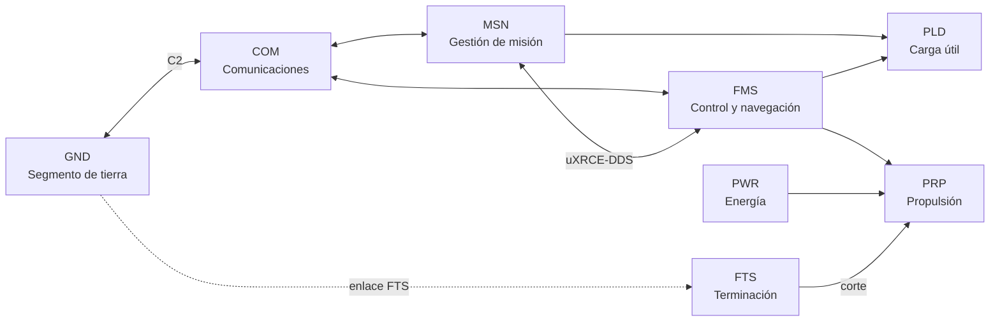
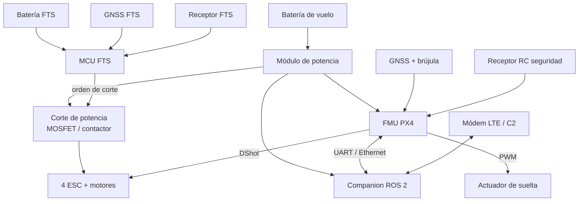
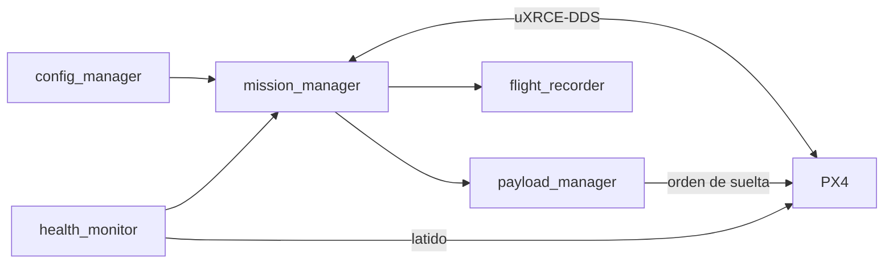

# DOC-05 Arquitectura del sistema (borrador v0.1)

Sep 25, 2026 · @Xabier

## 1. Principios de arquitectura

Cinco reglas guían todas las decisiones de este documento; si un diseño las rompe, necesita un ADR.

1. **PX4 es la autoridad final de vuelo.** ROS 2 solo propone consignas (modo Offboard o misión); PX4 las acepta o las rechaza y aplica sus propios failsafes. Protege AR-018.
2. **El FTS es independiente del autopiloto.** Tiene alimentación, receptor, GNSS y lógica propios, y actúa directamente sobre la potencia de los motores. Protege AR-011 y la descomposición de F6/F9.
3. **Seguro por defecto.** Ante pérdida de enlace, de companion o de datos válidos, el sistema pasa a un estado seguro definido, sin esperar decisión humana.
4. **Doble condición para acciones irreversibles.** La suelta de carga y el disparo del FTS necesitan dos condiciones independientes. Protege AR-007, AR-008 y AR-012.
5. **Configuración fuera del código.** Hub, geozonas, volúmenes y zonas de suelta se cargan como datos versionados. Protege AR-019.

## 2. Vista lógica

Ocho sistemas, siete a bordo y uno en tierra. La función crítica de contención (F6) se reparte deliberadamente entre FMS y FTS para conseguir la independencia.

La línea discontinua es el enlace propio del FTS, separado del C2. La suelta (PLD) solo se produce si llegan a la vez la orden de MSN y la autorización de FMS.

| Función | Sistemas | Reparto |
| --- | --- | --- |
| F1 Volar controladamente | FMS, PRP, PWR | FMS controla; PRP y PWR ejecutan |
| F2 Navegar | FMS | EKF2 con GNSS, IMU, barómetro, magnetómetro |
| F3 Gestionar la misión | MSN | Máquina de estados de la misión; envía misión y consignas a FMS |
| F4 Comunicar con tierra | COM, GND | Telemetría y comandos MAVLink |
| F5 Transportar y liberar la carga | PLD, MSN, FMS | MSN ordena; FMS autoriza por posición (volumen de suelta); PLD actúa |
| F6 Contener la operación | FMS, FTS | Miembro 1: geofence PX4. Miembro 2: geofence propio del FTS |
| F7 Gestionar la energía | PWR, FMS | PWR mide; FMS estima y aplica failsafe |
| F8 Supervisión humana | GND, COM | QGroundControl + mando RC de seguridad |
| F9 Limitar el daño | FTS | Corte de potencia por orden o por geofence propio |

## 3. Vista física

A bordo hay dos dominios físicamente separados: la cadena principal (batería de vuelo, FMU, companion, radios) y el FTS (batería, receptor, GNSS y microcontrolador propios). Los únicos puntos de contacto entre ellos son el corte de potencia de los ESC y una línea de estado aislada hacia el companion. Los modelos concretos se eligen en DOC-08.

| Interfaz | De → a | Tipo | Contenido |
| --- | --- | --- | --- |
| I-01 | FMU ↔ companion | UART de alta velocidad o Ethernet | uXRCE-DDS (tópicos uORB ↔ ROS 2) |
| I-02 | FMU ↔ companion (MAVLink, hacia LTE) | UART | MAVLink 2 |
| I-03 | Receptor RC → FMU | SBUS / CRSF | Mando manual del piloto de seguridad |
| I-04 | GNSS1 → FMU | UART o DroneCAN | Posición, velocidad, rumbo magnético |
| I-05 | FMU → ESC | DShot | Consignas de motor |
| I-06 | FMU → actuador de suelta | PWM | Apertura del mecanismo de retención |
| I-07 | MCU FTS → corte de potencia | Digital, fallo seguro por diseño a definir | Corte de alimentación de los ESC |
| I-08 | MCU FTS → companion | UART aislada (optoacoplador), solo del FTS al companion; ver DOC-06 §6 | Estado del FTS para telemetría y bloqueo de inicio de misión (SR-MSN-010) |
| I-09 | Tierra → receptor FTS | Radio independiente del C2 | Orden de terminación |
| I-10 | Companion ↔ tierra | Módem LTE | Enlace C2 principal (ADR-003): MAVLink sobre Internet |

**Tierra:** portátil con QGroundControl conectado por Internet (VPN) al dron, emisora RC del piloto de seguridad y emisor del FTS con interruptor protegido.

**Pendiente en I-07:** decidir qué pasa si el FTS pierde alimentación. Si el corte es "normalmente abierto" (los motores siguen), un fallo del FTS no tira el dron pero lo deja sin barrera. Si es "normalmente cerrado", un fallo del FTS provoca una caída (FC-11). Es una decisión de seguridad clave (ADR-004).

## 4. Software a bordo

En PX4 se usan módulos existentes configurados por parámetros, sin modificar el código. En ROS 2 se desarrollan cinco nodos propios. Todo lo que es crítico para la seguridad del vuelo queda en PX4.

**PX4 (FMU): módulos usados**

| Módulo | Uso en el proyecto |
| --- | --- |
| commander | Modos de vuelo, armado, failsafes (pérdida de enlace, de Offboard, batería) |
| navigator | Ejecución de misión, RTL, geofence |
| ekf2 | Estimación de estado y comprobaciones de integridad |
| mc\_pos\_control / mc\_att\_control / mc\_rate\_control | Lazos de control del multirrotor |
| battery\_status | Medida y estimación de energía |
| payload\_deliverer | Control del mecanismo de suelta (tipo gripper) |
| uxrce\_dds\_client | Puente con ROS 2 |
| mavlink | Telemetría y comandos con QGroundControl |

**ROS 2 (companion): nodos propios**

| Nodo | Responsabilidad | IDAL prov. |
| --- | --- | --- |
| `mission_manager` | Máquina de estados del ConOps §5; carga la misión en PX4 y supervisa su ejecución; calcula la energía para volver a nivel misión | C |
| `payload_manager` | Gestiona la suelta: espera la confirmación del piloto, comprueba el volumen de suelta y ordena a PX4 | C (ver §6) |
| `config_manager` | Carga la configuración de la operación (YAML/GeoJSON) y sube geofence y zonas a PX4 | C |
| `health_monitor` | Supervisa la salud del companion y de los nodos; emite el latido que PX4 vigila | C |
| `flight_recorder` | Registro de eventos de misión (rosbag2), sincronizado con el ULog de PX4 | D |

**Nodos con ciclo de vida (lifecycle):** todos, para que el arranque y la parada sean deterministas y `health_monitor` pueda detectar nodos inactivos.

**Autoridad en la suelta:** `payload_manager` pide la suelta, pero el volumen de suelta también se comprueba en PX4, con un módulo propio, drop\_guard, que filtra la orden al gripper (ADR-007). Así un fallo del companion no puede soltar la carga donde no toca. La zona de suelta llega a drop\_guard por parámetros cargados y verificados en prevuelo, bloqueados mientras el dron está armado: el companion no puede cambiarla en vuelo. Ambos miembros usan la posición del EKF2 de PX4, que es un modo común a justificar en la CCA (su fallo es FC-02).

**Confirmación del piloto:** desde QGroundControl por el C2 (LTE), porque en BVLOS el RC no es fiable (ADR-006). En los ensayos a la vista puede usarse además el interruptor CH7 de la emisora.

## 5. FTS e independencia; el problema de F1

El FTS resuelve la contención (F6) y la terminación (F9), pero no la pérdida de control (F1): cortar motores a un dron sin control sigue siendo una caída de 4 kg. Con la decisión de no llevar paracaídas (D7), FC-01 sigue siendo catastrófica y F1 queda en FDAL A sin un miembro independiente que lo reduzca.

**Diseño del FTS (propuesta)**

| Elemento | Decisión propuesta | Motivo |
| --- | --- | --- |
| Lógica | Microcontrolador sencillo con código mínimo (unos cientos de líneas), sin sistema operativo | Verificable con cobertura completa |
| Alimentación | Batería propia pequeña | Independencia frente a PWR (CCA) |
| Posición | GNSS propio, distinto modelo o fabricante que GNSS1 | Evita fallo de modo común en la geofence |
| Enlace | Receptor propio en banda distinta del C2 | Una interferencia no anula a la vez C2 y FTS |
| Disparo | Orden del piloto, o salida del volumen de contingencia según su GNSS | AR-011 |
| Protección contra disparo intempestivo | Armado en dos pasos + confirmación durante N ciclos | AR-012 |
| Actuación | Corte de alimentación de los ESC | Más simple y verificable que enviar comandos a los ESC |

**Opciones para F1 (decisión para ADR-005)**

| Opción | Qué implica | Coste para el proyecto |
| --- | --- | --- |
| A. Aceptar F1 en DAL A "declarado" | Documentar que PX4 no puede demostrarlo y que en un proyecto real habría que usar un autopiloto con evidencias | Nulo; honesto como ejercicio |
| B. Rebajar la severidad de FC-01 | Mitigar el efecto en tierra: rutas por corredores de muy baja densidad (AS-002) y limitación de energía de impacto; se revisa la clasificación con el MOC Light-UAS | Requiere justificar la densidad de población de cada ruta |
| C. Reconsiderar el paracaídas de aeronave | Volver sobre D7: el paracaídas + FTS sí convierte FC-01 en Peligroso o menos | Unos 200–400 g y 100–300 €; compite con la carga útil y el presupuesto |
| D. Redundancia de propulsión | Hexáptero u octóptero que tolere un fallo de motor | Más peso y coste; no cubre fallos de la FMU |

Decidido (ADR-005): A + B en fase 1, con C como mejora si el presupuesto de masa lo permite.

**Independencia a demostrar en la CCA**

- Zonal (ZSA): FTS y su batería separados físicamente de la FMU y de la batería principal.
- Riesgos particulares (PRA): fuego o rotura de batería principal, impacto de hélice, interferencia RF.
- Modo común (CMA): GNSS distinto, software distinto, banda de radio distinta, ninguna alimentación compartida.

## 6. IDAL provisional y asignación de requisitos

Con la descomposición propuesta, el software ROS 2 queda como mucho en IDAL C y el FTS en IDAL B. PX4 aparece en A por F1, con la salvedad del §5.

| Ítem | Funciones | FDAL de origen | Descomposición | IDAL prov. |
| --- | --- | --- | --- | --- |
| PX4 (configuración + módulos usados) | F1, F2, F6, F7 | A | F1 sin descomponer; F6 = PX4 (B) + FTS (B) | A declarado (ver ADR-005) |
| Hardware FMU | F1, F2 | A | Igual que PX4 | A declarado |
| Software MCU FTS | F6, F9 | A | F6 = PX4 (B) + FTS (B); F9 sin descomponer | B, o A si F9 no se descompone |
| Hardware FTS | F6, F9 | A | Igual | B / A |
| `payload_manager` + módulo PX4 drop\_guard | F5 | B | Dos miembros C + C | C |
| `mission_manager`, `config_manager`, `health_monitor` | F3 | C | — | C |
| `flight_recorder` | Soporte | — | — | D |
| QGroundControl | F8 | C | Software de terceros | C declarado |

**Punto abierto:** F9 no tiene un segundo miembro, así que el FTS debería ser DAL A. Como su lógica es muy pequeña, desarrollarlo con objetivos de DAL A (MC/DC incluido) es asumible y buen ejercicio de aprendizaje.

**Asignación de requisitos de aeronave a sistemas (base para los SR)**

| AR | Sistemas | AR | Sistemas |
| --- | --- | --- | --- |
| AR-001 | PRP, PLD, PWR | AR-011 | FTS |
| AR-002 | Todos | AR-012 | FTS |
| AR-003 | PWR, PRP, FMS | AR-013 | FMS, COM |
| AR-004 | PRP, FMS | AR-014 | FMS |
| AR-005 | FMS | AR-015 | FMS, MSN, PWR |
| AR-006 | MSN, FMS | AR-016 | GND, COM |
| AR-007 | PLD, MSN, GND | AR-017 | GND, COM, FMS, FTS |
| AR-008 | PLD, FMS, MSN | AR-018 | FMS, MSN |
| AR-009 | PLD, MSN | AR-019 | MSN, GND |
| AR-010 | FMS, FTS | AR-020 | MSN, FMS |

## 7. Estructura del modelo en Papyrus

Doorstop es la fuente de verdad de los requisitos; Papyrus lo es de la arquitectura. En el modelo, los requisitos solo aparecen como elementos «requirement» con el mismo ID para poder trazar «satisfy» y «allocate», sin copiar el texto.

| Paquete | Contenido | Diagramas SysML |
| --- | --- | --- |
| 00\_Contexto | Sistema, actores y entorno del ConOps | BDD de contexto, casos de uso |
| 01\_Requisitos | Referencias AR/SR por ID (sin texto) | Diagrama de requisitos solo para trazas clave |
| 02\_Funcional | Funciones F1–F9 y flujo de la misión | Actividad |
| 03\_Logico | Los 8 sistemas, sus puertos y flujos | BDD + IBD (equivale al §2) |
| 04\_Fisico | Equipos e interfaces I-01…I-10 | BDD + IBD (equivale al §3) |
| 05\_Asignacion | Función → sistema, lógico → físico | Tablas o matrices de asignación |
| 06\_Comportamiento | Máquina de estados de misión (ConOps §5) y del FTS | Máquina de estados |
| 07\_Interfaces | InterfaceBlocks, tipos de datos y unidades | BDD de interfaces |

**Primeros cinco diagramas a construir:** BDD de contexto, BDD de sistemas lógicos, IBD lógico, máquina de estados de la misión e IBD físico.

**Convenciones:** nombres de sistemas con su código (FMS, MSN…); IDs iguales a los de Doorstop; un máximo de unos 15 elementos por diagrama; unidades SI con ValueTypes de la librería QUDV. El fichero del modelo va en el repo `drone-model` y se exportan imágenes de los diagramas en cada baseline.

## 8. Decisiones de arquitectura (ADR) y preguntas abiertas

Ocho decisiones aceptadas y dos propuestas; ninguna abierta.

| ADR | Decisión | Estado |
| --- | --- | --- |
| ADR-001 | PX4 es la autoridad final de vuelo; ROS 2 solo propone | Aceptada |
| ADR-002 | FTS independiente con alimentación, GNSS, radio y lógica propios | Propuesta |
| ADR-003 | Enlace C2 por LTE/4G en fase 1: módem en el companion y MAVLink encaminado a la FMU (p. ej. mavlink-router) | Aceptada (25/09/2026) |
| ADR-004 | Si falla el FTS, los motores siguen funcionando; el fallo se detecta en prevuelo y en vuelo (I-08) y dispara un RTL | Aceptada (25/09/2026) |
| ADR-005 | F1 se trata con las opciones A + B: se declara que PX4 no puede demostrar DAL A y se rebaja el riesgo con rutas por corredores de muy baja densidad. El paracaídas queda como mejora futura | Aceptada (25/09/2026) |
| ADR-006 | La confirmación de suelta del piloto llega desde QGroundControl por el C2 (LTE), porque en BVLOS el RC no es fiable. El interruptor CH7 de la emisora solo se usa en ensayos a la vista. La confirmación es un requisito de operación, no una barrera independiente | Aceptada (25/09/2026), sustituye a la versión con RC |
| ADR-007 | F5 (FDAL B) se descompone en dos miembros independientes de IDAL C: `payload_manager` en ROS 2 y un módulo propio en PX4, `drop_guard`, que solo deja pasar la orden al gripper dentro de la zona de suelta. Implica mantener un fork de PX4 | Aceptada (25/09/2026) |
| ADR-008 | Interfaz FMU ↔ companion por UART (la Pixhawk 6C Mini no tiene Ethernet); ver DOC-08 | Propuesta (sigue a DOC-08) |

**ADR-009 (aceptada, 25/09/2026):** AR-003 se divide en un objetivo de sistema (5 km de radio, validado en simulación) y un límite del prototipo físico de fase 1 (al menos 1,5 km). Motivo: el presupuesto de energía del X500 V2 con 1 kg de carga (DOC-08 §4).

**ADR-010 (aceptada, 30/09/2026):** la confirmación del piloto la comprueba solo `payload_manager`; `drop_guard` autoriza por posición, altura y precisión, pero no la conoce (DOC-15, hallazgo 1). Se decide por fases:

- **S3 y simulación:** se acepta el estado actual. Riesgo registrado: una orden de apertura dentro de la zona y de la banda de altura, sin confirmación, por un ataque o por un fallo de `payload_manager`. El efecto es FC-05 con AS-001 sin comprobación operativa; lo acota la zona de `drop_guard`.
- **Ensayos a la vista:** `drop_guard` puede leer CH7 como autorización independiente del companion (opcional, ADR-006).
- **Condición de caducidad:** antes del primer vuelo con hardware real en el que la confirmación llegue por LTE, o fuera de la vista, `drop_guard` exigirá una autorización con caducidad que el companion no pueda fabricar (desafío-respuesta con HMAC o segundo canal físico; el mecanismo se decide en un ADR posterior). Un comando MAVLink sin firma no vale: PX4 v1.17.0 no la implementa. La condición se comprueba en la FRR (DOC-09 §0).
- **Reserva de interfaz, sin implementar:** `design/drop_guard-diseno.md` §2 reserva la entrada de autorización y el estado «sin ventana».

No cambia nada de las condiciones de suelta: sigue haciendo falta la confirmación explícita y la orden se envía una sola vez por suelta, sin reintentos.

Alternativas descartadas: exigir la autorización ya en S3 (retrasa el hito y no hay un atacante real con el que probarla) y aceptar el riesgo sin fecha límite.

**Consecuencias de ADR-003 (LTE):**

- El companion entra en la cadena del C2. Si el companion falla, se pierde el C2 y PX4 hace RTL por pérdida de enlace (FC-04, Mayor). Esto no rompe AR-018, pero hay que reflejarlo en la FHA de sistema de COM y MSN.
- La latencia y la cobertura celular en altura (60–100 m) no están garantizadas: hay que medirlas en Toulouse antes de fijar TBD-2.
- El receptor RC del piloto de seguridad (I-03) queda como único enlace directo, válido solo a corta distancia (despegue, aterrizaje, ensayos VLOS).
- Requiere un servidor o VPN para unir el dron y la GCS por Internet; se añade al segmento de tierra.
