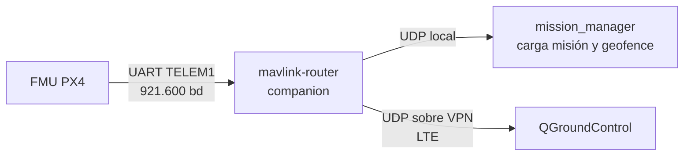

# DOC-06 Documento de control de interfaces (borrador v0.1)

Sep 25, 2026 · @Xabier

## 1. Convenciones

Todas las interfaces usan unidades SI y dejan explícito el marco de referencia; la conversión NED ↔ ENU se hace en un único sitio del código propio.

| Tema | Convención |
| --- | --- |
| Unidades | SI: m, m/s, rad, s, V, A. Coordenadas geográficas en grados WGS84; altitud MSL o AGL siempre indicada |
| Marco en PX4 | NED local (x norte, y este, z abajo); el cuerpo en FRD |
| Marco en ROS 2 | ENU (REP-103). La conversión NED ↔ ENU vive solo en una librería común de `drone_core` |
| Tiempo | Los mensajes de PX4 llevan `timestamp` en µs del reloj de PX4; los nodos propios usan el reloj de ROS. En simulación, `use_sim_time` |
| QoS de tópicos PX4 | BEST\_EFFORT, TRANSIENT\_LOCAL, KEEP\_LAST 1 |
| QoS de tópicos propios | Estado y eventos: RELIABLE, TRANSIENT\_LOCAL; flujos a alta frecuencia: BEST\_EFFORT |
| Nombres | Tópicos propios bajo `/drone/<sistema>/...` |
| Versionado | Cada interfaz tiene versión; un cambio incompatible sube la versión y pasa por gestión de cambios (Planes §5) |

## 2. Mapa de interfaces

Tres familias: I-xx físicas y de protocolo entre equipos (vienen de DOC-05 §3), R-xx entre nodos ROS 2 propios y F-xx ficheros de configuración.

| ID | Entre | Medio | Protocolo | Sección |
| --- | --- | --- | --- | --- |
| I-01 | FMU ↔ companion | UART TELEM2 | uXRCE-DDS | §3 |
| I-02 | FMU ↔ companion | UART TELEM1 | MAVLink 2 (hacia LTE) | §4 |
| I-03 | Receptor RC → FMU | Puerto RC | CRSF (ExpressLRS) | §5 |
| I-04 | GNSS1 → FMU | Puerto GPS1 | UBX + I2C brújula | Estándar Pixhawk, sin trabajo propio |
| I-05 | FMU → ESC | Salidas MAIN | DShot | Estándar, sin trabajo propio |
| I-06 | FMU → actuador de suelta; sensor → companion | PWM; GPIO | — | §5 |
| I-07 | FTS → corte de potencia | Señal digital | — | §6 |
| I-08 | FTS → companion | UART aislada | Mensaje de estado propio | §6 |
| I-09 | Emisor de tierra → receptor FTS | Radio 868 MHz | CRSF (ExpressLRS) | §6 |
| I-10 | Companion ↔ tierra | LTE + VPN | MAVLink 2 sobre UDP | §4 |
| R-01…R-06 | Nodos ROS 2 propios | DDS | Mensajes y servicios de `drone_interfaces` | §7 |
| F-01…F-03 | Ficheros de operación y misión | Disco / Git | YAML + GeoJSON | §7 |

**Cambio respecto a DOC-05:** I-08 pasa de líneas digitales hacia la FMU a una UART aislada hacia el companion. Motivo: leer el estado del FTS desde PX4 exigiría un módulo propio en PX4, y ADR-001 prefiere no modificarlo. La consecuencia está en SR-MSN-010.

## 3. I-01 uXRCE-DDS (FMU ↔ companion)

Por DDS van los datos de tiempo real y las órdenes inmediatas; la carga de misión y geofence va por MAVLink (§4), porque PX4 las gestiona con su protocolo de misión. Los tópicos que PX4 publica se definen en su fichero `dds_topics.yaml`: hay que comprobar en la versión fijada que están todos y añadir los que falten.

**Enlace:** UART TELEM2 a 921.600 baudios (UXRCE\_DDS\_CFG, SER\_TEL2\_BAUD); en simulación, UDP 8888. Espacio de nombres por defecto `/fmu`.

**Nombres en PX4 v1.17:** el cliente DDS añade el sufijo `_vN` cuando el mensaje tiene MESSAGE\_VERSION distinto de 0. En esta tabla afecta a vehicle\_status, vehicle\_local\_position y battery\_status (v1); home\_position también es v1. Offboard, consignas, órdenes y posición global van sin sufijo.

| Tópico | Sentido | Mensaje | Frecuencia | Usuario | Para |
| --- | --- | --- | --- | --- | --- |
| `/fmu/in/offboard_control_mode` | → PX4 | OffboardControlMode | ≥ 10 Hz | mission\_manager | Latido Offboard (SR-MSN-006) |
| `/fmu/in/trajectory_setpoint` | → PX4 | TrajectorySetpoint | 10–20 Hz | mission\_manager | Consignas en fases Offboard |
| `/fmu/in/vehicle_command` | → PX4 | VehicleCommand | Por evento | mission\_manager, payload\_manager | Modo, armado, aterrizaje, regreso, gripper |
| `/fmu/out/vehicle_command_ack` | ← PX4 | VehicleCommandAck | Por evento | Ambos | Confirmación de cada orden |
| `/fmu/out/vehicle_status`\_v1 | ← PX4 | VehicleStatus | \~5 Hz | Todos | Modo, armado, failsafe |
| `/fmu/out/failsafe_flags` | ← PX4 | FailsafeFlags | \~1 Hz | health\_monitor | Motivo de los failsafes |
| `/fmu/out/vehicle_local_position`\_v1 | ← PX4 | VehicleLocalPosition | \~50 Hz | mission\_manager, payload\_manager | Posición NED y validez |
| `/fmu/out/vehicle_global_position` | ← PX4 | VehicleGlobalPosition | \~50 Hz | mission\_manager, payload\_manager | Lat/lon para zonas GeoJSON |
| `/fmu/out/vehicle_land_detected` | ← PX4 | VehicleLandDetected | Por evento | mission\_manager | Fin de aterrizaje |
| `/fmu/out/battery_status`\_v1 | ← PX4 | BatteryStatus | \~10 Hz | mission\_manager | Energía (SR-MSN-005) |
| `/fmu/out/wind` | ← PX4 | Wind | \~1 Hz | mission\_manager | Viento estimado (SR-MSN-007), a comprobar si se publica |

**Órdenes por VehicleCommand**

| Orden | Comando | Emisor |
| --- | --- | --- |
| Cambiar a Offboard | VEHICLE\_CMD\_DO\_SET\_MODE (1, 6) | mission\_manager |
| Armar / desarmar | VEHICLE\_CMD\_COMPONENT\_ARM\_DISARM | mission\_manager |
| Iniciar misión | VEHICLE\_CMD\_MISSION\_START o cambio a modo Misión | mission\_manager |
| Regreso | VEHICLE\_CMD\_NAV\_RETURN\_TO\_LAUNCH | mission\_manager |
| Aterrizar | VEHICLE\_CMD\_NAV\_LAND | mission\_manager |
| Abrir mecanismo de suelta | VEHICLE\_CMD\_DO\_GRIPPER (liberar) | payload\_manager |

**drop\_guard (ADR-007, SR-FMS-007):** módulo propio en el fork de PX4. Intercepta VEHICLE\_CMD\_DO\_GRIPPER y solo lo deja llegar a payload\_deliverer si la posición del EKF2 está dentro de la zona de suelta y en la banda de altura. Si no, rechaza la orden con VehicleCommandAck y un motivo.

| Parámetro | Contenido |
| --- | --- |
| DG\_ENABLE | Activa el filtro (obligatorio en vuelo) |
| DG\_LAT\_E7, DG\_LON\_E7 | Centro de la zona de suelta (grados × 10⁷, enteros) |
| DG\_RADIUS | Radio de la zona (m); círculo en v1 por sencillez, polígono más adelante |
| DG\_ALT\_MIN, DG\_ALT\_MAX | Banda de altura de suelta sobre el punto de despegue (m) |
| DG\_POS\_VALID | Exige posición válida y precisión horizontal por debajo de un umbral \[TBD\] |

Los parámetros DG\_\* los carga el MSN antes de armar a partir de la zona de F-02; el piloto los verifica en el prevuelo y drop\_guard rechaza cualquier cambio con la aeronave armada. Así el companion no puede mover la zona durante el vuelo.

## 4. I-02 / I-10 MAVLink sobre LTE

MAVLink sale de la FMU por UART hacia el companion, donde `mavlink-router` lo reparte: una salida hacia tierra por la VPN y otra local para que el MSN cargue misión y geofence.

| Parámetro | Valor |
| --- | --- |
| Enlace físico | UART TELEM1 (MAV\_0\_CONFIG), 921.600 baudios |
| Transporte hacia tierra | UDP dentro de una VPN WireGuard (SR-COM-005-D); la IP del companion es fija dentro de la VPN |
| Identificadores | FMU: sistema 1, componente 1 · companion: sistema 1, componente 191 · GCS: sistema 255 |
| Firma MAVLink 2 | Activada si la versión de PX4 y QGroundControl lo admiten; la VPN ya autentica el canal |

| Flujo | Mensajes principales | Sentido |
| --- | --- | --- |
| Telemetría (≥ 1 Hz, SR-COM-002) | HEARTBEAT, SYS\_STATUS, GLOBAL\_POSITION\_INT, ATTITUDE, BATTERY\_STATUS, EXTENDED\_SYS\_STATE | FMU → tierra |
| Estado propio | NAMED\_VALUE\_INT/FLOAT o STATUSTEXT con fase de misión, estado del FTS y calidad del enlace | Companion → tierra |
| Órdenes del piloto (SR-GND-002) | COMMAND\_LONG: pausa, NAV\_RETURN\_TO\_LAUNCH, NAV\_LAND | Tierra → FMU |
| Misión y geofence (SR-MSN-003) | Protocolo de misión (MISSION\_COUNT, MISSION\_ITEM\_INT…) con MAV\_MISSION\_TYPE\_MISSION y \_FENCE; relectura para verificar | Companion → FMU |
| Calidad del enlace (SR-COM-003) | Latencia medida con TIMESYNC o ping propio; pérdida por secuencia de paquetes | Companion ↔ tierra |

**Confirmación de suelta (ADR-006):** el companion avisa a tierra de que el dron está en posición (STATUSTEXT + valor de fase). El piloto confirma desde QGroundControl con un COMMAND\_LONG dirigido al companion (componente 191), por ejemplo un MAV\_CMD\_USER\_1 \[a definir\]. payload\_manager lo recibe por la salida local de mavlink-router y solo entonces envía VEHICLE\_CMD\_DO\_GRIPPER, que drop\_guard filtra en PX4.

**Librería en el MSN:** MAVSDK o pymavlink para el protocolo de misión. Propuesta: MAVSDK (C++), porque ya implementa la carga y relectura de misión y geofence.

## 5. I-03 RC del piloto de seguridad e I-06 suelta

El mando RC sirve para el piloto de seguridad a corta distancia. En BVLOS la confirmación de suelta llega desde QGroundControl por LTE (ADR-006, §4). Como en BVLOS el RC queda fuera de alcance de forma normal, perder el RC no debe provocar un regreso mientras el C2 por LTE funcione.

**Mapa de canales (ExpressLRS 2,4 GHz, CRSF)**

| Canal | Función | Parámetro PX4 | Nota |
| --- | --- | --- | --- |
| CH1–CH4 | Alabeo, cabeceo, gas, guiñada | RC\_MAP\_ROLL/PITCH/THROTTLE/YAW | Estándar |
| CH5 | Modo de vuelo, 3 posiciones: Posición / Misión / Regreso | RC\_MAP\_FLTMODE | Toma de control inmediata (SR-FMS-008) |
| CH6 | Corte de motores (kill switch) | RC\_MAP\_KILL\_SW | Interruptor con protección; es un corte de la cadena principal, no sustituye al FTS |
| CH7 | Confirmación de suelta, solo en ensayos a la vista (ADR-006) | Ninguno; lo lee payload\_manager | Llega al MSN por DDS; añadir el tópico de canales RC a `dds_topics.yaml` si no está |
| CH8 | Regreso inmediato | RC\_MAP\_RETURN\_SW | Redundante con CH5 |

**Pérdida de RC:** excepción en modos Misión y Offboard (COM\_RCL\_EXCEPT) para que la pérdida de RC en BVLOS no dispare un regreso. En modo Posición, la pérdida de RC sí dispara el failsafe.

**I-06 actuador de suelta y sensor de carga**

| Elemento | Especificación |
| --- | --- |
| Actuador | Servo en una salida de la FMU configurada como gripper; posiciones cerrado/abierto en µs \[TBD según mecanismo\] |
| Fallo seguro (SR-PLD-003) | Cierre mecánico con muelle: el servo tiene que actuar para abrir; sin señal ni alimentación, la carga queda retenida |
| Sensor de carga (SR-PLD-004) | Microinterruptor al GPIO del companion con resistencia de pull-up; filtrado de rebotes de 50 ms |
| Lectura | payload\_manager publica `/drone/payload/state` (R-03) |

## 6. Interfaces del FTS (I-07, I-08, I-09)

El FTS toca la cadena principal en solo dos puntos, ambos con aislamiento galvánico: el corte de potencia (I-07) y el estado hacia el companion (I-08). Su enlace con tierra (I-09) es propio.

**I-07 orden de corte**

| Aspecto | Especificación |
| --- | --- |
| Circuito | MOSFET de potencia en la línea de los ESC. Su puerta se mantiene activa desde la batería principal por una resistencia; el FTS la lleva a cero a través de un optoacoplador para cortar |
| Fallo del FTS (SR-FTS-005) | Sin alimentación del FTS el optoacoplador no conduce, la puerta sigue activa y los motores siguen alimentados (ADR-004) |
| Nivel activo | Optoacoplador activado = corte |
| Enclavamiento | Una vez disparado, el corte se mantiene hasta rearmar el FTS en tierra |
| Tiempo | Desde la condición de disparo hasta el corte, menos de TBD-5 ms (SR-FTS-001) |

**I-08 estado del FTS hacia el companion**

UART aislada con optoacoplador, 57.600 baudios, solo del FTS al companion. Una trama cada 200 ms:

| Campo | Tipo | Contenido |
| --- | --- | --- |
| Cabecera | 2 bytes | 0xF7 0x5A |
| Versión | uint8 | Versión del protocolo |
| Estado | uint8 | 0 DESARMADO, 1 ARMADO, 2 DISPARADO, 3 FALLO |
| Causa del disparo | uint8 | 0 ninguna, 1 orden del piloto, 2 volumen de contingencia |
| GNSS | uint8 + uint8 | Tipo de solución y número de satélites |
| Dentro del volumen | uint8 | 1 si su posición está dentro del volumen de contingencia |
| Batería FTS | uint16 | mV |
| Enlace I-09 | uint8 | Calidad del enlace (0–100) |
| Configuración | uint32 | Hash del volumen de contingencia cargado (SR-FTS-006) |
| CRC | uint16 | CRC-16/CCITT |

Si el companion no recibe una trama válida en 1 s, considera el FTS no sano (SR-MSN-010).

**I-09 enlace de terminación**

| Aspecto | Especificación |
| --- | --- |
| Radio | ExpressLRS 868 MHz, emisor dedicado en tierra |
| Canal A | Armado del FTS (interruptor de 2 posiciones con protección) |
| Canal B | Terminación (pulsador protegido) |
| Lógica (SR-FTS-003) | Terminación solo con canal A armado y canal B activo durante al menos 0,5 s |
| Pérdida de enlace (SR-FTS-008) | No termina; se informa en I-08 |

## 7. Interfaces ROS 2 propias (R-xx) y ficheros (F-xx)

Las interfaces propias se definen en un paquete `drone_interfaces` (solo mensajes, servicios y acciones), separado de la lógica, para que su versión se controle aparte.

| ID | Nombre | Tipo | Publica / sirve | Consume | QoS | Contenido |
| --- | --- | --- | --- | --- | --- | --- |
| R-01 | `/drone/mission/state` | msg MissionState | mission\_manager | Todos, telemetría | RELIABLE, TRANSIENT\_LOCAL | Estado, estado anterior, causa, id de misión |
| R-02 | `/drone/payload/drop` | action DropPayload | payload\_manager | mission\_manager | Acción estándar | Objetivo: zona de suelta · Realimentación: esperando confirmación / soltando · Resultado: soltado, denegado, tiempo agotado, no liberado |
| R-03 | `/drone/payload/state` | msg PayloadState | payload\_manager | mission\_manager, telemetría | RELIABLE, TRANSIENT\_LOCAL | Carga presente, estado del mecanismo, último resultado |
| R-04 | `/drone/health/status` | msg HealthStatus | health\_monitor | mission\_manager, telemetría | RELIABLE | Estado de cada nodo, edad de su latido, estado del FTS (de I-08) |
| R-05 | `/drone/config/active` | msg ActiveConfig | config\_manager | Todos | RELIABLE, TRANSIENT\_LOCAL | Ciudad, versión y hashes de la configuración y del volumen de contingencia |
| R-06 | `/drone/energy/estimate` | msg EnergyEstimate | mission\_manager | Telemetría | BEST\_EFFORT, 1 Hz | Energía restante, necesaria para volver, reserva, regreso requerido |

**F-01 `ops/<ciudad>.yaml`**: ciudad, hub (lat, lon, alt), límites (altura máxima), referencia al GeoJSON y versión. Ya existe en el hito S1 con los campos mínimos.

**F-02 `ops/<ciudad>.geojson`**: una Feature por zona con la propiedad `role`:

| role | Geometría | Propiedades |
| --- | --- | --- |
| `operational_volume` | Polígono | `max_alt_m` |
| `contingency_volume` | Polígono | — (lo usa el FTS) |
| `corridor` | Línea + anchura | `id`, `width_m` |
| `drop_zone` | Polígono | `id`, `drop_alt_min_m`, `drop_alt_max_m` |
| `no_fly` | Polígono | `id` |
| `authorization_zone` | Polígono | `id`, `authority` (p. ej. CTR de Blagnac) |
| `emergency_landing` | Punto | `id` |

**F-03 `missions/<id>.yaml`**: ciudad, zona de suelta, masa de la carga, corredores usados y la lista de waypoints generada. El MSN la valida contra F-01 y F-02 antes de cargarla (SR-MSN-002).

## 8. Cambios en otros documentos y puntos abiertos

El ICD cambia una interfaz de DOC-05 y añade dos paquetes de software; el resto son comprobaciones en la versión de PX4 que se fije.

**Cambios que arrastra**

- DOC-05 §3: I-08 pasa a ser una UART aislada del FTS al companion.
- DOC-05 §4: nuevos paquetes `drone_interfaces` (mensajes, servicios, acciones) y `drone_core` (librería común: conversión NED/ENU, lectura de configuración y GeoJSON).
- DOC-03: nuevos TBD-4 a TBD-7.

**Puntos abiertos**

- [ ] ADR-007 decidido: módulo drop\_guard en el fork de PX4. Pendiente: diseñarlo y fijar el umbral de precisión de DG\_POS\_VALID.
- [ ] Comprobado en PX4 v1.17.0: failsafe\_flags, wind, home\_position y vehicle\_command\_ack ya se exportan; drop\_guard\_status se añade con el parche. Falta añadir los canales RC si se usa CH7 en ensayos a la vista.
- [ ] Confirmar MAVSDK (C++) para el protocolo de misión.
- [ ] Confirmar que la Raspberry Pi 5 tiene libres dos UART (I-01, I-02), una tercera para I-08 y un GPIO para el sensor de carga.
- [ ] Revisar las limitaciones de uso de la banda de 868 MHz en Europa para el enlace del FTS.
- [ ] Posiciones del servo de suelta, cuando se diseñe el mecanismo.

* [ ] Firma MAVLink 2: PX4 v1.17.0 no la implementa (DOC-15, hallazgo 2); la fila «Firma MAVLink 2» de §4 no se cumple hasta que se decida el ADR C.
* [ ] Definir el comando MAVLink de confirmación de suelta y cómo lanzarlo desde QGroundControl (botón o acción personalizada).
