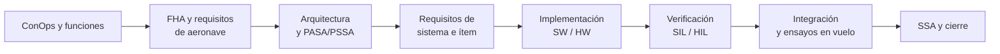

# DOC-09 Planes ARP4754A

Sep 25, 2026 · @Xabier

## 0. Visión general

El desarrollo sigue un ciclo en V según ARP4754A, con seis revisiones que actúan de puerta: no se pasa a la siguiente etapa sin cerrar la anterior. Como hay un solo ingeniero, cada revisión es una autorrevisión con checklist (ver §6) y queda registrada en Git.

| Revisión | Cuándo | Entrada mínima para cerrarla |
| --- | --- | --- |
| SRR: revisión de requisitos del sistema | Tras ConOps, FHA y SRS | DOC-01, DOC-03, DOC-04 (FHA) en baseline; requisitos validados |
| PDR: revisión preliminar de diseño | Tras arquitectura | DOC-05, DOC-06, PASA/PSSA, DAL asignados, ADR de HW |
| CDR: revisión crítica de diseño | Antes de implementar en serio | DOC-07, DOC-08, requisitos de ítem, procedimientos de prueba |
| TRR: revisión de preparación de ensayos | Antes de cada campaña SIL/HIL | Procedimientos aprobados, configuración congelada |
| FRR: revisión de aptitud para vuelo | Antes del primer vuelo real | HIL superado, FTS probado, OM (DOC-12), seguro y permisos |
| Cierre de fase | Al final de cada fase (1, 2, 3) | SSA actualizada, matriz de trazabilidad completa, lecciones aprendidas |

La fase 1 recorre la V entera dos veces: primero en simulación (hasta TRR SIL) y luego con hardware (hasta FRR). Las fases 2 y 3 reabren la V desde el ConOps con análisis de impacto sobre lo ya aprobado.

## 1. Plan de desarrollo

Define cómo se pasa de las funciones a un sistema implementado: jerarquía de requisitos, reparto entre PX4 y ROS 2, estándares y entornos. Es el plan "paraguas" y los demás cuelgan de él.

**Jerarquía de requisitos e identificadores**

| Nivel | Prefijo | Ejemplo | Documento |
| --- | --- | --- | --- |
| Función de aeronave | F- | F5 Transportar y liberar la carga | Análisis funcional |
| Requisito de aeronave | AR- | AR-012 La carga no se liberará fuera de la zona de suelta | DOC-03 |
| Requisito de sistema | SR- | SR-PLD-004 El mecanismo de suelta requiere dos condiciones independientes | DOC-03 / DOC-05 |
| Requisito de ítem (SW/HW) | IR- | IR-ROS-031 El nodo de misión publicará el estado a 10 Hz | DOC-07 / DOC-08 |
| Requisito derivado | sufijo -D | SR-NAV-010-D | Se notifica siempre a seguridad (§2) |

Cada requisito lleva: texto ("El sistema deberá…"), justificación, padre, DAL, método de verificación (Inspección, Análisis, Demostración, Ensayo) y estado.

**Sistemas previstos (asignación provisional, a confirmar en PDR)**

| Sistema | Código | Contenido |
| --- | --- | --- |
| Propulsión y estructura | PRP | Frame, motores, ESC, hélices |
| Energía | PWR | Batería, módulo de potencia, distribución |
| Control y navegación | FMS | PX4 sobre FMU, IMU, GNSS, barómetro, magnetómetro |
| Gestión de misión | MSN | Companion + nodos ROS 2 |
| Comunicaciones | COM | Enlace C2, telemetría, RC de seguridad |
| Carga útil | PLD | Retención, suelta, paracaídas del paquete |
| Terminación de vuelo | FTS | Receptor, lógica y corte de potencia independientes |
| Segmento de tierra | GND | QGroundControl, planificación, registro de vuelos |

**Estándares y referencias de proceso**

| Área | Referencia | Uso en este proyecto |
| --- | --- | --- |
| Sistema | ARP4754A | Proceso completo |
| Seguridad | ARP4761A | FHA, PASA/PSSA, SSA, CCA |
| Software | DO-178C | Como guía de objetivos según DAL; sin cualificación de herramientas |
| Hardware electrónico | DO-254 | Solo como referencia para el FTS |
| Codificación C++ | ROS 2 style guide + subconjunto MISRA C++:2023 | Obligatorio en código de DAL C o superior |
| Requisitos | ISO/IEC/IEEE 29148 | Redacción y atributos |
| Operación / regulación | SORA 2.5, MOC Light-UAS | Ver §7 |

**Entornos**

| Entorno | Herramientas |
| --- | --- |
| Modelado | Eclipse Papyrus con SysML 1.6 (versión fijada) para arquitectura y diagramas de estados |
| Requisitos y trazabilidad | Git + ficheros YAML/Markdown + Doorstop (versión fijada; un fichero YAML por requisito) |
| Desarrollo | Ubuntu 24.04, ROS 2 Jazzy, PX4 v1.17, Gazebo Harmonic, colcon |
| Integración continua | GitHub Actions: build, tests unitarios, análisis estático, SITL en el runner con el mismo script de instalación nativa |
| Tierra | QGroundControl |

## 2. Plan del programa de seguridad

La seguridad sigue ARP4761A en paralelo al desarrollo: cada revisión de §0 exige que el análisis de seguridad de esa etapa esté cerrado. El objetivo es demostrar que ninguna condición catastrófica depende de un fallo simple.

| Análisis | Nivel | Entrada | Salida | Revisión |
| --- | --- | --- | --- | --- |
| FHA de aeronave | Aeronave | Funciones F1–F9, ConOps | Condiciones de fallo y severidad | SRR |
| PASA | Aeronave | FHA, arquitectura preliminar | Objetivos de seguridad, FDAL, requisitos de independencia | PDR |
| FHA de sistema | Cada sistema de §1 | Asignación función → sistema | Condiciones de fallo por sistema | PDR |
| PSSA | Sistema | FHA de sistema, arquitectura | Árboles de fallos preliminares, IDAL, requisitos de seguridad derivados | CDR |
| CCA: ZSA, PRA, CMA | Aeronave / sistema | Arquitectura física e instalación | Confirmación de independencia (p. ej. FTS frente a FMU) | CDR |
| FMEA / FMES | Componente | Diseño de detalle y hojas de datos | Modos de fallo y tasas para los árboles | Antes de FRR |
| SSA / ASA | Sistema / aeronave | Todo lo anterior + resultados de verificación | Demostración de cumplimiento de objetivos | Cierre de fase |

**Asignación de DAL**

- Base: ARP4754A Tabla 5-2 (Catastrófico → A, Peligroso → B, Mayor → C, Menor → D), con posibilidad de bajar un nivel si hay independencia demostrada entre miembros.
- A revisar: si el MOC Light-UAS.2510 permite DAL reducidos para UAS ligeros; en ese caso se aplica su tabla y se documenta en un ADR.
- Hipótesis de arquitectura a proteger: PX4 + FTS cubren las condiciones catastróficas, y el companion ROS 2 queda en DAL C o D.

**Objetivos cuantitativos:** se fijarán en la PASA a partir del MOC Light-UAS.2510. Hasta entonces no se usan cifras.

**Reglas del programa**

- Todo requisito derivado (-D) pasa por seguridad antes de entrar en baseline.
- Todo cambio de arquitectura dispara un análisis de impacto sobre FHA y PSSA.
- Los árboles de fallos se versionan en Git junto al modelo; herramienta por decidir (p. ej. software FTA de código abierto o un modelo en Python).

## 3. Plan de validación de requisitos

Validar es comprobar que los requisitos son los correctos y están completos, antes de diseñar contra ellos. Un requisito solo entra en baseline cuando está validado.

| Método | Cuándo se usa | Ejemplo |
| --- | --- | --- |
| Trazabilidad | Siempre | Todo AR- tiene padre F- o condición de fallo FC-; todo SR- tiene padre AR- |
| Análisis | Requisitos de prestaciones y seguridad | Presupuesto de energía que justifica 10 km + 20 % de reserva |
| Modelado y simulación | Comportamiento dinámico, modos, contingencias | Escenario SITL de pérdida de C2 que valida el requisito de RTL |
| Revisión con checklist | Todos | Checklist de calidad (abajo) |
| Experiencia / comparación | Valores límite | Viento máximo operativo frente a drones comerciales de clase similar |

**Checklist de calidad de un requisito** (ISO 29148): necesario, sin ambigüedad, verificable, factible, consistente con el resto, trazable, con justificación escrita, sin solución de diseño implícita salvo que sea intencionada.

**Rigor según DAL:** DAL A–B exigen validación de todos los requisitos por al menos dos métodos, uno de ellos análisis o simulación. DAL C–D admiten revisión + trazabilidad.

**Matriz de validación:** columna en el fichero de requisitos con método, evidencia (enlace a análisis, escenario o acta) y estado (Propuesto / Validado / Rechazado). Se genera un informe de cobertura en cada revisión.

**Hipótesis:** se registran como requisitos especiales (prefijo AS-) con el mismo proceso de validación; por ejemplo, AS-001 "La zona de suelta está libre de personas durante la suelta".

## 4. Plan de verificación

Verificar es demostrar que la implementación cumple cada requisito. Se hace por niveles, de lo más barato a lo más arriesgado, y no se vuela hardware hasta haber superado el nivel anterior.

| Nivel | Qué se prueba | Entorno | Criterio de paso |
| --- | --- | --- | --- |
| 1. Unitario | Nodos ROS 2, lógica de misión y de suelta | gtest / pytest, launch\_testing, en CI | 100 % de tests pasan; cobertura según DAL |
| 2. Integración SW | ROS 2 ↔ PX4 vía uXRCE-DDS | PX4 SITL + Gazebo, sin cabeza en CI | Escenarios nominales automatizados en verde |
| 3. Sistema en simulación (SIL) | Misión completa y contingencias | SITL + mundo de Toulouse | Todos los escenarios de fallo de la FHA reproducidos y mitigados |
| 4. Hardware en el bucle (HIL) | FMU y companion reales, planta simulada | Pixhawk + companion en banco, PX4 HIL | Mismos escenarios que SIL con temporizaciones reales |
| 5. Banco y tierra | Motores, empuje, batería, FTS, mecanismo de suelta | Banco de empuje, pruebas atado | Valores medidos dentro de presupuesto; FTS corta en menos del tiempo requerido |
| 6. Vuelo | Prestaciones y funciones en entorno real | Terreno autorizado, sin terceros | Según procedimiento de cada ensayo, con criterios de aborto |

**Métodos (IADT):** Inspección, Análisis, Demostración, Ensayo. Cada requisito declara el suyo en el Plan de desarrollo (§1).

**Cobertura de software según DAL (inspirado en DO-178C)**

| DAL | Cobertura estructural objetivo |
| --- | --- |
| A | MC/DC |
| B | Decisión |
| C | Sentencia |
| D | Solo basada en requisitos |

PX4 se trata como software de terceros (COTS/código abierto): no se re-verifica entero; se verifica su configuración (parámetros bajo control) y las funciones que el proyecto usa, con ensayos basados en requisitos.

**Escenarios mínimos de SIL (derivados de la FHA):** pérdida de C2, pérdida de GNSS, batería crítica, cruce de geofence, caída del companion, fallo de motor, suelta no ordenada (inyectada), viento fuera de límites.

**Trazabilidad:** requisito → caso de prueba → resultado → versión de configuración. El informe se genera desde Git en cada TRR y cierre de fase. Un fallo de prueba abre un informe de problema (PR) en el sistema de gestión de cambios (§5).

## 5. Plan de gestión de configuración

Todo lo que define el sistema vive en Git y se congela en baselines ligadas a las revisiones de §0. Si algo no está en Git, no existe para el proyecto.

**Elementos de configuración y repositorios**

| Repositorio | Contenido | Control |
| --- | --- | --- |
| `drone-docs` | Documentos DOC-xx, requisitos (YAML), matrices de trazabilidad, actas de revisión | CC1 |
| `drone-model` | Modelo SysML, árboles de fallos | CC1 |
| `drone-ros` | Workspace ROS 2: paquetes de misión, carga útil, interfaces, launch | CC1 |
| `drone-px4` | Fork o submódulo de PX4 fijado a un tag + ficheros de parámetros y airframe | CC1 |
| `drone-sim` | Mundos Gazebo (Toulouse), modelos, escenarios de prueba | CC2 |
| `drone-hw` | Lista de materiales, esquemas, CAD del soporte de carga y del FTS | CC1 |

CC1 = control completo (baseline, cambios con informe de problema). CC2 = versionado sin proceso formal de cambio.

**Baselines**

| Baseline | Se congela en | Contiene |
| --- | --- | --- |
| Funcional | SRR | ConOps, funciones, FHA, requisitos de aeronave |
| Asignada | PDR | Arquitectura, requisitos de sistema, DAL |
| De diseño | CDR | Requisitos de ítem, diseño SW/HW |
| De producto | TRR / FRR | Código, parámetros PX4, HW montado, procedimientos |

**Ramas y versiones:** `main` protegida; ramas de trabajo por cambio; merge solo con CI en verde y autorrevisión con checklist. Tags `vFASE.BASELINE.N` (p. ej. `v1.PDR.0`).

**Gestión de cambios:** cada cambio en un elemento CC1 empieza por un informe de problema o petición de cambio (issue) con: descripción, análisis de impacto (requisitos, seguridad, pruebas afectadas), decisión y verificación de cierre.

**Parámetros de PX4:** son configuración, no ajustes sueltos. El fichero de parámetros de cada vuelo se exporta, se compara con la baseline y se archiva con el log (ULog) del vuelo.

**Versiones fijadas:** PX4, ROS 2, Gazebo, Micro XRCE-DDS Agent y SO se fijan por versión exacta, en el script de instalación nativa, versionado en Git.

## 6. Plan de aseguramiento de proceso

Con un solo ingeniero no hay independencia real, así que se compensa con dos cosas: separación en el tiempo (revisar al menos 48 h después de escribir) y checklists cerradas que dejan evidencia en Git.

| Actividad | Cuándo | Evidencia |
| --- | --- | --- |
| Autorrevisión de entregable | Antes de cada merge a `main` de un elemento CC1 | Checklist marcada en la pull request |
| Auditoría de revisión | En cada SRR, PDR, CDR, TRR, FRR | Acta con criterios de entrada/salida y acciones abiertas |
| Auditoría de configuración | Al congelar cada baseline | Informe: lo construido coincide con lo documentado |
| Revisión externa (opcional) | PDR y FRR | Comentarios de un colega o de la comunidad PX4, si es posible |
| Registro de desviaciones | Siempre que no se siga un plan | Entrada en el registro de decisiones (DOC-14) con motivo |

**Checklists a preparar:** requisito (§3), diseño, código (estándar de §1), procedimiento de prueba, criterios de entrada y salida de cada revisión, prevuelo.

**Métrica de salud del proceso:** acciones abiertas por revisión, requisitos sin validar, requisitos sin verificar, informes de problema abiertos por DAL. Se revisan al cierre de cada revisión.

## 7. Plan de cumplimiento (sustituto del plan de certificación)

No hay autoridad ni certificado, pero el ejercicio se hace como si se fuera a presentar: una autoevaluación contra el marco que aplicaría a esta operación en Francia.

| Marco | Qué se demuestra | Documento |
| --- | --- | --- |
| Reglamento (UE) 2019/947, categoría Específica | Que la operación (BVLOS urbana con suelta) no cabe en Abierta ni en un escenario estándar y requiere autorización | DOC-02 |
| SORA 2.5 | GRC, ARC, SAIL y cumplimiento de los OSO con su nivel de robustez | DOC-02 |
| MOC Light-UAS (EASA) | Severidades, objetivos de seguridad y DAL para el diseño | DOC-04 + §2 |
| Requisitos nacionales DGAC | Registro, formación del piloto remoto, zonas en Toulouse (proximidad al aeropuerto de Blagnac) | DOC-02 |
| U-space (Reg. UE 2021/664) | Servicios necesarios en fase 2 | DOC-02 (fase 2) |

**Matriz de cumplimiento:** cada punto aplicable (OSO de SORA, requisito del MOC) se lista con su método de cumplimiento y la evidencia enlazada, igual que una matriz de certificación.

**Vuelos reales del prototipo:** no se harán en ciudad. Se volará en un terreno de aeromodelismo o zona autorizada, dentro de la categoría Abierta cuando sea posible (VLOS, sin suelta sobre personas) o con la autorización que corresponda para probar la suelta. Esto se concreta en la FRR.

**Preguntas abiertas de esta pestaña**

- [ ] Herramienta SysML: Papyrus con SysML 1.6 (decidido)
- [ ] Herramienta de requisitos: Doorstop (decidido)
- [ ] Repos y CI: GitHub + GitHub Actions (decidido)
- [ ] Terreno de ensayos: terreno de aeromodelismo en Blagnac (propuesto). Pendiente: confirmar con el club sus condiciones, porque está junto al aeropuerto de Toulouse-Blagnac, en su zona de control (CTR). Esos terrenos suelen volar con altura máxima reducida y protocolo propio con el control aéreo. Hay que comprobar si admiten multirrotores de 4 kg, vuelos automatizados y ensayos de suelta, y revisar las restricciones en el mapa de Geoportail
