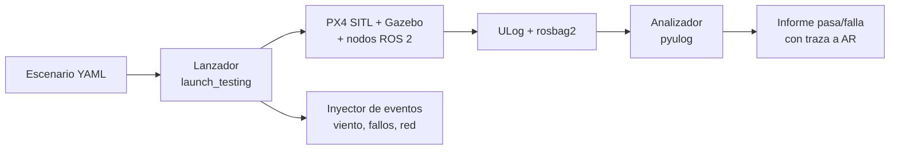

# DOC-10 Plan de simulación (borrador v0.1)

Sep 25, 2026 · @Xabier

## 1. Objetivo y alcance

La simulación cubre los niveles 2 y 3 del plan de verificación (integración SW y sistema en SIL). Debe demostrar la misión completa, todas las contingencias de la FHA y el objetivo de 5 km de AR-003 antes de comprar el primer lote de hardware.

| Qué demuestra | Evidencia para |
| --- | --- |
| Misión nominal completa (despegue → suelta → regreso) | AR-006, validación del ConOps |
| Contingencias FC-02 a FC-12 reproducidas y mitigadas | AR-007 a AR-018, FHA |
| Radio de 5 km con 1 kg y reserva del 20 % (con modelo de energía calibrado) | AR-003, objetivo de sistema (ADR-009) |
| Independencia funcional de PX4 frente a caídas de ROS 2 | AR-018, ADR-001 |
| Operación parametrizada por ciudad | AR-019 |

**Fuera de alcance:** validar la aerodinámica, la batería real, la cobertura LTE o el GNSS en cañones urbanos. Eso queda para HIL, banco y vuelo (§7).

## 2. Entorno

Sin contenedor: todo el entorno se instala de forma nativa con un script versionado en el repositorio `drone-sim`, con las versiones de la tabla fijadas en `drone.repos` (formato vcstool) del mismo repositorio. El portátil y el runner de GitHub Actions ejecutan el mismo script de instalación.

| Componente | Versión (a fijar en la baseline) | Papel |
| --- | --- | --- |
| Ubuntu | 24.04 LTS | SO base |
| ROS 2 | Jazzy (LTS) | Nodos propios |
| PX4 | Última estable en el momento de la baseline | Autopiloto en SITL |
| Gazebo | Harmonic (LTS, pareja oficial de Jazzy) | Física y sensores |
| Micro XRCE-DDS Agent | Versión compatible con la de PX4 | Puente uORB ↔ ROS 2 |
| QGroundControl | Estable | Estación de tierra |
| pyulog / pandas | — | Análisis automático de logs |

**Equipo de desarrollo:** Ubuntu 24.04 nativo, sin contenedor (decidido el 29/09/2026); Gazebo con interfaz gráfica necesita una GPU decente. Si el portátil va justo, la simulación corre sin interfaz (headless) y se observa desde QGroundControl y RViz.

## 3. Modelos

El vehículo parte del modelo `x500` que PX4 ya incluye para Gazebo, que corresponde al airframe elegido en DOC-08. El resto se añade por capas; tres modelos son desarrollo propio: el FTS, la suelta con paracaídas y la energía.

| Modelo | Punto de partida | Trabajo propio | Prioridad |
| --- | --- | --- | --- |
| Vehículo | `gz_x500` de PX4 | Ajustar masa e inercia a \~3,0 kg (DOC-08 §4); variante con y sin carga | Alta |
| Carga y suelta | Gripper simulado de PX4 (payload\_deliverer), a comprobar | Objeto de 1 kg que se separa al soltar, con paracaídas modelado como arrastre | Alta |
| Viento | Plugin de viento de Gazebo | Perfiles: calma, 8 m/s sostenido, ráfagas de 11 m/s, fuera de límites | Alta |
| Energía | Batería simulada de PX4 (descarga simple, no física) | Modelo de consumo propio calibrado con los datos del X500; se usa para AR-003 | Alta |
| FTS | Nada | Nodo o plugin separado de PX4 con su propia posición (verdad del simulador + ruido) que corta los motores en Gazebo | Alta |
| Enlace LTE | Red local | Latencia, jitter y cortes con `tc netem` entre la GCS y el companion | Media |
| Fallos de sensores | Inyección de fallos de PX4 (comando de failure) | Scripts por escenario: GNSS, motor, brújula | Alta |
| Caída del companion | Terminar los procesos de los nodos | Script por escenario | Alta |

**Importante:** la batería simulada de PX4 no sirve para demostrar autonomía. AR-003 se verifica con el modelo de energía propio, alimentado con el perfil de vuelo de la simulación, y se recalibra con datos reales en los ensayos de banco y de vuelo.

## 4. Mundo de Toulouse y parametrización

El mundo se construye en dos pasos: primero un terreno plano con las coordenadas reales de Toulouse y las zonas cargadas desde ficheros, y después edificios y relieve reales. Lo que cambia de una ciudad a otra vive solo en ficheros de configuración (AR-019).

| Paso | Contenido | Para qué |
| --- | --- | --- |
| A. Mundo plano georreferenciado | Origen en el hub de Toulouse; geofence, zonas de suelta y corredores cargados desde GeoJSON | Todos los escenarios de lógica y contingencias |
| B. Mundo urbano | Edificios de OpenStreetMap y relieve de un modelo digital del terreno (p. ej. del IGN) | Rutas realistas, visualización, preparación de la cámara futura |

**Fichero de configuración por ciudad (`ops/<ciudad>.yaml` + GeoJSON)**

| Campo | Ejemplo |
| --- | --- |
| `home` / `hub` | Coordenadas y altitud del hub |
| `operational_volume` | Polígono + altura máxima (≤ 120 m) |
| `contingency_volume` | Polígono exterior que usa el FTS |
| `corridors` | Rutas de baja densidad (AS-002), p. ej. a lo largo del Garona o del canal del Midi |
| `drop_zones` | Polígonos de suelta + altura de suelta |
| `no_fly` | Zonas prohibidas y zonas con autorización (p. ej. la CTR de Toulouse-Blagnac) |
| `emergency_landing` | Puntos de aterrizaje de emergencia |

El volumen operacional de Toulouse tiene que respetar el espacio aéreo real del aeropuerto de Blagnac, aunque sea solo simulación: el ejercicio es diseñar la operación como si fuera real. Si la zona de control cubre la ciudad, se modela como zona que exige autorización y coordinación, no como zona prohibida.

## 5. Catálogo de escenarios

Son 20 escenarios: 4 nominales o de prestaciones, 14 de fallo derivados de la FHA y 2 de operación. Los valores umbral pendientes son los TBD de DOC-03 §3.

| ID | Escenario | Traza | Criterio de paso |
| --- | --- | --- | --- |
| SIM-01 | Misión nominal, sin viento, 1,5 km | AR-006 | Misión completa; suelta dentro de la zona; aterriza en el hub con ≥ 20 % de energía |
| SIM-02 | Misión nominal, 5 km, modelo de energía propio | AR-003 | Energía al aterrizar ≥ 20 % según el modelo calibrado |
| SIM-03 | Viento de 8 m/s con ráfagas de 11 m/s | AR-004 | Misión completa; error de trayectoria dentro del margen \[TBD\] |
| SIM-04 | Viento fuera de límites | AR-004, AS-003 | La misión no se inicia o se aborta con regreso |
| SIM-05 | Llegada a la zona sin confirmación del piloto | AR-007 | No suelta; espera y regresa al agotar el tiempo |
| SIM-06 | Orden de suelta fuera del volumen de suelta | AR-008, FC-05 | Suelta inhibida por PX4 aunque ROS 2 la ordene |
| SIM-07 | Carga que no se libera | AR-009, FC-07 | Detectado en < TBD-1; aviso al piloto; regreso con carga |
| SIM-08 | Pérdida del C2 en crucero | AR-013, FC-04 | Contingencia tras TBD-2 |
| SIM-09 | LTE degradado (latencia y cortes) | AR-016 | Refresco ≥ 1 Hz o enlace declarado degradado |
| SIM-10 | Pérdida de GNSS | AR-014, FC-03 | Contingencia en < TBD-3 |
| SIM-11 | Deriva de posición no detectada por PX4 | FC-02 | Contenida por la geofence propia del FTS |
| SIM-12 | Cruce de la geofence | AR-010, FC-08 | Contingencia de PX4 en el límite |
| SIM-13 | Fly-away con la geofence de PX4 desactivada | AR-011, FC-08 | El FTS termina el vuelo al cruzar el volumen de contingencia |
| SIM-14 | Terminación ordenada por el piloto | AR-011, AR-017 | Motores cortados en < \[TBD\] s |
| SIM-15 | Señales espurias hacia el FTS | AR-012, FC-11 | Ninguna señal aislada provoca la terminación |
| SIM-16 | Caída del companion en crucero | AR-018 | PX4 ejecuta contingencia segura sin intervención |
| SIM-17 | Batería crítica | AR-015, FC-09 | Regreso o aterrizaje al alcanzar el umbral |
| SIM-18 | Fallo de un motor | FC-01 | Informativo: se registra el resultado; documenta el riesgo residual (ADR-005) |
| SIM-19 | Intervención del piloto en cada fase (pausa, regreso, aterrizaje) | AR-017 | Respuesta correcta en todas las fases |
| SIM-20 | Misión SIM-01 con la configuración de otra ciudad | AR-019 | Funciona sin cambiar código |

## 6. Automatización, métricas y CI

Cada escenario es un fichero de datos más un test automatizado que arranca la simulación, inyecta los eventos, analiza el log y devuelve pasa o falla. Nada se da por verificado mirando la pantalla.

**Contenido de un escenario:** ciudad, misión, perfil de viento, lista de eventos con su instante (p. ej. "t = 120 s: corta el C2"), métricas a calcular y criterios de paso.

**Métricas automáticas:** tiempos de reacción (evento → cambio de modo), distancia mínima a los límites de geofence, posición de suelta frente a la zona, energía al aterrizar, transiciones de la máquina de estados.

**En GitHub Actions:**

| Disparador | Qué se ejecuta |
| --- | --- |
| Cada pull request | Tests unitarios + SIM-01, SIM-06, SIM-12 y SIM-16 (humo de seguridad) sin interfaz gráfica |
| Cada noche o manual | Los 20 escenarios |
| Antes de una TRR | Los 20 escenarios con las versiones congeladas (PX4, px4\_msgs, agente XRCE y commit de drone-sim); el informe se archiva en `drone-docs` |

Los runners gratuitos de GitHub pueden quedarse cortos para Gazebo; si pasa, la simulación de CI corre más lenta que el tiempo real o se usa un runner propio en el PC.

## 7. Límites de validez de la simulación

La simulación verifica lógica, secuencias y reacción a fallos; no verifica física ni entorno real. Cada limitación tiene asignado dónde se cierra.

| Lo que la simulación no reproduce bien | Dónde se cierra |
| --- | --- |
| Aerodinámica real y respuesta a ráfagas | Ensayos de vuelo |
| Descarga real de la batería | Banco de empuje + vuelo; recalibración del modelo de energía |
| Temporización real de la FMU y del companion | HIL (nivel 4) |
| Cobertura, latencia y cortes de LTE en altura | Medidas en Toulouse con el módem |
| GNSS con multitrayecto urbano | Ensayos de vuelo; análisis de la FHA de sistema |
| Comportamiento del paracaídas del paquete | Ensayos de suelta en tierra y en vuelo |
| Vibraciones e interferencias electromagnéticas | Banco y vuelo |

Regla: un requisito verificado solo en simulación se marca así en la matriz de trazabilidad hasta que tenga evidencia de HIL o de vuelo, salvo AR-003, cuyo objetivo de 5 km se acepta en simulación por ADR-009.

## 8. Hitos y preguntas abiertas

Siete pasos llevan del entorno vacío a la TRR de simulación, que abre la compra del primer lote de hardware (DOC-08 §3).

| Hito | Contenido | Escenarios que habilita |
| --- | --- | --- |
| S1 | Entorno nativo con PX4 SITL + Gazebo + ROS 2 + agente XRCE; `x500` volando desde ROS 2 | — |
| S2 | `mission_manager` y `config_manager`; mundo plano de Toulouse | SIM-01, SIM-19, SIM-20 |
| S3 | Suelta: `payload_manager`, gripper simulado, módulo drop\_guard en el fork de PX4, confirmación desde QGroundControl | SIM-05, SIM-06, SIM-07 |
| S4 | Inyección de fallos y contingencias | SIM-08 a SIM-10, SIM-12, SIM-16 a SIM-18 |
| S5 | FTS simulado independiente | SIM-11, SIM-13 a SIM-15 |
| S6 | Viento y modelo de energía | SIM-02 a SIM-04 |
| S7 | Automatización completa en CI + informe de trazabilidad | Todos → TRR SIL |

**Estado (25/09/2026):** S2 terminado y verificado contra PX4 v1.17.0 SITL (SIH) con ROS 2 Jazzy. SIM-01, SIM-19 (pausa y RTL del piloto) y SIM-20 pasan con el ejecutor `scripts/s2_scenarios.py`; 64 tests unitarios correctos. En SIM-01 la suelta todavía es simulada (llega en S3). Desviaciones abiertas: la misión se vuela por tramos con DO\_REPOSITION en lugar de cargarla por MAVLink; la geofence de PX4 aún no se carga (SR-MSN-003 pasa a S4); los nodos no son lifecycle todavía.

**Entorno (29/09/2026):** sin contenedor. El portátil con Ubuntu 24.04 se instala con `scripts/setup_native.sh` (fork `drone-px4` sobre PX4 v1.17.0 con drop\_guard como commits, agente XRCE v2.4.3, px4\_msgs release/1.17; todo fijado en `drone.repos`) y se comprueba con `scripts/check_native.sh`; ambos se ejecutaron en el portátil el 29/09/2026 con 15 comprobaciones correctas, 0 fallidas y los 64 tests unitarios; se repitió en un clon limpio de `drone-sim` con el mismo resultado, y el workflow `nightly` de GitHub Actions reproduce la instalación completa y la comprobación en el runner estándar (unos 23 min con caché). El simulador por defecto es SIH, con Gazebo opcional.

**Preguntas abiertas**

- [ ] PC de desarrollo: portátil Lenovo IdeaPad con Ubuntu nativo (decidido). Con gráfica integrada, los escenarios automatizados corren sin interfaz y la interfaz de Gazebo se reserva para depurar y demos, con el mundo plano (paso A). Comprobar la RAM: 16 GB van holgados; con 8 GB hay que cerrar todo lo demás.
- [ ] Ubicación del hub de Toulouse para la simulación. Es probable que la zona de control de Toulouse-Blagnac cubra gran parte de la ciudad (comprobar en Geoportail). En ese caso, la CTR se modela como zona que exige autorización y no como zona prohibida. Propuesta aceptada: hub en el terreno de aeromodelismo de Blagnac, el mismo lugar de los ensayos reales, para que simulación y vuelo compartan origen. Pendiente: sus coordenadas exactas, y trazar corredores que no crucen los ejes de aproximación de la pista.
- [ ] Segunda ciudad para SIM-20: Donostia (decidido).
- [ ] ADR-007 decidido (módulo drop\_guard): el entorno de simulación tendrá que compilar PX4 desde el fork propio a partir de S3.
