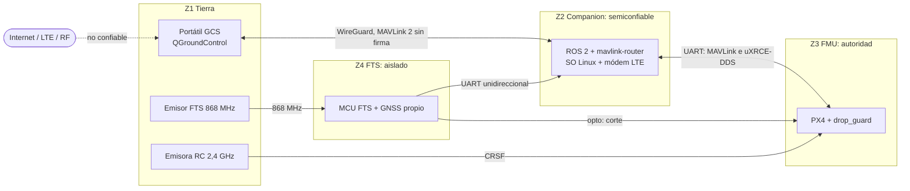

# DOC-15 Análisis de seguridad de la información (borrador v0.1)

Sep 30, 2026 · @Xabier

Modelo de amenazas ligero del sistema en fase 1. Responde a una pregunta: ¿qué puede hacer una persona que quiere hacer daño, o un error de seguridad informática, y cómo llega eso a las condiciones de fallo de la FHA (DOC-04)? No es un proceso certificable. Toma como inspiración ED-202A / DO-326A (seguridad de la información en aeronavegabilidad) y su método ED-203A / DO-356A, sin pretender cumplirlos.

**Comprobado en el código (30/09/2026):** las afirmaciones sobre PX4 salen de leer el árbol `drone-sim/.deps/PX4-Autopilot` en el tag `v1.17.0-1.0.0` (`Commander.cpp`, `mavlink_parameters.cpp`, `src/modules/mavlink`). No se han probado en ejecución; para eso están los casos de §8.

**Qué cambia respecto a lo que había:** solo existía `SR-COM-005-D` («C2 cifrado y autenticado extremo a extremo»). Este documento lo revisa, añade AR-028 y AR-029, FC-19 y FC-20 (DOC-04), y los requisitos derivados SR-SEC-001-D a SR-SEC-013-D (DOC-03 §5).

## 1. Hallazgos principales

Seis cosas que el diseño actual no cubre. Las tres primeras cambian decisiones ya aceptadas.

1. **La confirmación del piloto la comprueba un solo miembro** (decidido por fases en ADR-010). `drop_guard` autoriza la apertura por posición, altura, precisión y parámetros; no sabe nada de la confirmación del piloto (`design/drop_guard-diseno.md` §3). La exige `payload_manager`, en el companion. Cualquier `DO_GRIPPER` de apertura que llegue a PX4 dentro de la zona (por DDS local o por MAVLink) se acepta sin confirmación. Frente a un fallo, ADR-007 da dos miembros independientes; frente a un ataque, AR-007 depende de uno solo (TH-04, TH-05, TH-01).
2. **PX4 v1.17.0 no implementa la firma de MAVLink 2.** Se buscó en `src/modules/mavlink` (30/09/2026) y no hay código de firma. DOC-06 §4 la da por activada «si la versión lo admite»: no se admite. Con ella, `SR-COM-005-D` («extremo a extremo») queda cubierto solo hasta el companion, que es justo el elemento que se trata como comprometible (§2).
3. **Una orden de C2 puede matar el vuelo.** PX4 acepta por MAVLink o por DDS, sin comprobar el origen, `DO_FLIGHTTERMINATION` (con la aeronave armada pasa a `NAVIGATION_STATE_TERMINATION`) y el desarme forzado en vuelo (`21196` en `COMPONENT_ARM_DISARM`). Es una vía a FC-11 que no pasa por el FTS ni por su doble armado (TH-01).
4. **Los parámetros de PX4 se pueden cambiar en vuelo.** El manejador de `PARAM_SET` no comprueba el armado ni el origen. Solo `drop_guard` se protege capturando `DG_*` al armar. `GF_*` y los failsafes no (TH-13).
5. **El GNSS «distinto» del FTS no da independencia frente a un ataque.** DOC-05 §5 lo pide para evitar fallos de modo común; un emisor de GNSS falso o un inhibidor engaña a la vez a la geofence de PX4, a `drop_guard` y, muy probablemente, al FTS (TH-09).
6. **`drop_zone_hash` es un CRC32.** Detecta errores, no manipulación (TH-12).

## 2. Alcance, atacantes y principio de diseño

**Dentro:** el dron completo (FMU, companion, FTS, RC), el segmento de tierra (portátil con QGroundControl, emisores), los enlaces (LTE + VPN, RC 2,4 GHz, FTS 868 MHz, GNSS), los ficheros de operación y la cadena de software (repos, dependencias, CI).

**Fuera en esta versión:** el backend de pedidos y la privacidad de los clientes (fase 3), atacantes con recursos estatales, ataques físicos invasivos a los chips, y la seguridad del operador de telefonía.

| Atacante | Capacidad supuesta |
| --- | --- |
| A1. Remoto oportunista | Alcanza por Internet lo que el sistema exponga; herramientas públicas |
| A2. Cercano con radio | Emisor RF barato: inhibidor, GNSS falso, emisor ELRS; a cientos de metros del dron o del hub |
| A3. Con acceso físico breve | Puede tocar el dron o el portátil en el hub unos minutos |
| A4. De la cadena de suministro | Modifica una dependencia, un paquete o una acción de CI |
| A5. Error interno | Operador o desarrollador con credenciales que se equivoca |

**Principio de diseño.** El companion se trata como comprometible. Es coherente con ADR-001 (ROS 2 propone, PX4 dispone) y con AR-024 de la FHA: un companion malicioso es la misma condición que un companion defectuoso (FC-16), y la contención (geofence de PX4, FTS, `drop_guard`) no debe depender de él. Lo que este análisis añade es que hoy esa independencia tiene huecos frente a órdenes que no son consignas (hallazgos 1, 3 y 4).

## 3. Activos y fronteras de confianza

| Activo | Por qué importa | Propiedad crítica |
| --- | --- | --- |
| Orden de suelta y confirmación del piloto | Única acción irreversible del vuelo (AR-007) | Integridad |
| Órdenes de C2 (modo, pausa, RTL, aterrizaje, armado, terminación) | Mandan sobre el vuelo | Integridad, disponibilidad |
| Solución de navegación (GNSS, EKF2) | Alimenta la geofence, `drop_guard` y el FTS | Integridad, disponibilidad |
| Parámetros de PX4 y ficheros F-01…F-03 | Definen los límites de contención y la zona de suelta | Integridad |
| Orden de armado y de terminación del FTS (I-09) | Última barrera y causa de FC-11 | Integridad |
| Software y firmware (PX4, ROS 2, SO del companion) | Ejecutan todo lo anterior | Integridad |
| Claves y credenciales (VPN, SSH, cuentas de GitHub) | Habilitan el acceso a lo anterior | Confidencialidad |
| Telemetría y registros (ULog, rosbag) | Evidencia y análisis; datos de ubicación | Integridad; confidencialidad menor |

La confidencialidad importa poco aquí: los repos son públicos y nada es secreto salvo las claves. Lo que pesa es la integridad y la disponibilidad de órdenes y de datos de navegación.

- **Z3 es la autoridad, y la frontera Z2/Z3 es la más importante.** Para las órdenes revisadas (terminación, desarme forzado, `PARAM_SET`, `DO_GRIPPER`), PX4 no comprueba quién las manda al cruzar de Z2 a Z3 (I-01, I-02).
- **Z4 está bien aislado por diseño:** I-08 es unidireccional y con optoacoplador; el companion no puede escribir al FTS (TH-19).
- **La frontera con Internet (I-10)** está protegida por la VPN, pero el companion es su extremo, no la FMU.

## 4. Amenazas

Se recorre STRIDE sobre las interfaces de DOC-06. Viabilidad cualitativa: B baja, M media, A alta. El efecto se expresa en condiciones de fallo de DOC-04.

| ID | Dónde | Amenaza | STRIDE | Atacante | Viab. | Efecto |
| --- | --- | --- | --- | --- | --- | --- |
| TH-01 | I-10 → I-02 | Alguien con la clave de la VPN, o que roba el portátil, manda a la FMU órdenes de C2 falsas: modo, RTL, aterrizaje, desarme forzado, terminación de vuelo o apertura de la carga | S, E | A1, A3 | M | FC-19 (Catastrófico), FC-05 |
| TH-02 | I-10 | Repetición de una orden capturada, incluida la confirmación de suelta | R | A1 | B | FC-05, FC-19 |
| TH-03 | I-10 | Denegación del C2: inhibidor LTE, estación falsa, saturación | D | A2 | A | FC-04 (Mayor) |
| TH-04 | Z2 | Compromiso del companion (servicio expuesto en LTE, SSH débil, dependencia, USB) | T, E | A1, A3, A4 | M | FC-16 (Peligroso), FC-05 sin confirmación, FC-19 |
| TH-05 | I-01 | Proceso local o nodo ROS 2 ajeno publica en `/fmu/in/vehicle_command` (DDS sin autenticar) | S, E | A4, A5 | M | FC-05 sin confirmación, FC-16 |
| TH-06 | Z2 → piloto | Telemetría falseada (`STATUSTEXT` «en posición») hace que el piloto confirme la suelta con datos falsos | S, T | A4 | B | FC-05 |
| TH-07 | I-09 | Orden de armado o de terminación del FTS forjada o repetida | S, R | A2 | B–M | FC-11 (Catastrófico) |
| TH-08 | I-09 | Inhibición del enlace del FTS | D | A2 | M | FC-12 combinada con FC-08 |
| TH-09 | I-04 | GNSS falso o inhibido | S, D | A2 | M | FC-02, FC-08, FC-05, FC-03 |
| TH-10 | I-03 | Toma del mando por RC con un emisor ELRS ajeno (el RC tiene prioridad sobre el autopiloto, SR-FMS-008) | S, E | A2 | B–M | FC-19, FC-01 |
| TH-11 | Hub | Manipulación física: parámetros, tarjeta SD, puerto de depuración, hélices | T | A3 | B–M | FC-20, FC-16 |
| TH-12 | F-01…F-03 | Fichero de operación o de misión alterado (en el repo público, en tránsito o en el dron) | T | A1, A4 | M | FC-20, FC-08, FC-05 |
| TH-13 | I-02, I-10 | `PARAM_SET` en vuelo: se amplía la geofence o se anulan los failsafes | T, E | A1, A4 | M | FC-20, FC-08 |
| TH-14 | Software | Dependencia, `px4_msgs`, agente XRCE, fork de PX4 o acción de CI modificados | T | A4 | B–M | FC-16, cualquiera |
| TH-15 | Repos, GCS | Claves o credenciales filtradas (repos públicos, portátil robado, historial de Git) | I | A1, A3, A5 | M | Habilita TH-01 y TH-04 |
| TH-16 | I-01 | Saturación del bus DDS o de la UART por un proceso del companion | D | A4, A5 | B | FC-15 (Mayor) |
| TH-17 | Registros | Telemetría con ubicación de entregas (privacidad) | I | A1 | B | Sin FC; fase 3 |
| TH-18 | Z1 | Portátil de la GCS con malware que actúa con la clave legítima | E | A1 | M | FC-19, FC-05 |
| TH-19 | I-08 | Datos falsos del FTS hacia el companion | S | A4 | B | Solo bloquea el inicio (SR-MSN-010) |

## 5. Controles, huecos y estado

Estados: **Mitigado** (control existente suficiente), **Abierto** (hay un requisito derivado propuesto), **Aceptado** (con motivo), **A comprobar**.

| ID | Controles que ya existen | Hueco | Estado | Requisitos |
| --- | --- | --- | --- | --- |
| TH-01 | WireGuard entre GCS y companion (DOC-06 §4) | Detrás del companion nada autentica; PX4 no firma MAVLink (hallazgo 2); PX4 acepta terminación y desarme forzado desde cualquier origen (hallazgo 3) | Abierto | SR-SEC-001, 002, 003 |
| TH-02 | WireGuard rechaza repeticiones en tránsito. Una sola apertura por suelta, sin reintentos | Sin identificador ni caducidad a nivel de aplicación | Abierto | SR-SEC-005 |
| TH-03 | Failsafe de C2 con RTL (AR-013); FC-04 es Mayor | Ninguno adicional: el efecto es seguro | Aceptado. Un inhibidor no cambia FC-04 |  |
| TH-04 | ADR-001, `drop_guard`, FTS, vigilancia de consigna (SR-MSN-011-D) | La confirmación del piloto no llega a PX4 (hallazgo 1); MAVLink local sin filtro; sin endurecimiento del companion | Aceptado temporalmente en SR-SEC-004 (ADR-010); abierto en el resto | SR-SEC-004, 006, 007, 008 |
| TH-05 | Solo `drop_guard` | Cualquier publicador DDS local puede mandar `vehicle_command` | Aceptado temporalmente en SR-SEC-004 (ADR-010); abierto en SR-SEC-006 | SR-SEC-004, 006 |
| TH-06 | El piloto mira posición, altura y viento (ConOps §4); AS-001. `drop_guard` usa la posición real de la FMU | Si el companion está comprometido, la telemetría de estado no es fiable | Aceptado con AS-001: el límite duro es la zona de `drop_guard` |  |
| TH-07 | Doble armado y 0,5 s de persistencia (SR-FTS-003); banda 868 MHz | La «binding phrase» de ExpressLRS identifica el enlace, pero no debe darse por autenticación criptográfica (a comprobar); una grabación de un disparo legítimo se podría repetir | A comprobar | SR-SEC-013 |
| TH-08 | El disparo automático por GNSS del FTS no depende del enlace; banda distinta del C2 | Con el enlace inhibido el piloto pierde la terminación manual | Aceptado. La independencia de banda protege frente a fallos, no frente a un inhibidor de banda ancha |  |
| TH-09 | Comprobaciones de innovación del EKF2; `drop_guard` exige `eph`/`epv` | Ningún módulo de vuelo de PX4 v1.17.0 usa `jamming_state` ni `spoofing_state` (solo se reenvían por el stream `GNSS_INTEGRITY`); los dos GNSS caen a la vez; la CCA de DOC-05 §5 no considera ataque | Abierto | SR-SEC-012 |
| TH-10 | El RC en BVLOS queda fuera de alcance de forma natural; ELRS con clave de enlace | Prioridad del RC sobre el autopiloto | A comprobar | SR-SEC-013 |
| TH-11 | Prevuelo: suma de control de parámetros (SR-FMS-009) y hash de configuración por I-08 | Sin sellado ni registro de acceso al hub | Aceptado por ahora; se tratará en DOC-12 |  |
| TH-12 | Ruleset de `main`, PR y CI; `drop_zone_hash` (CRC32) | CRC32 no protege frente a manipulación; la cadena repo → dron no está firmada | Abierto | SR-SEC-008, 009 |
| TH-13 | `drop_guard` congela `DG_*` al armar | `GF_*`, `COM_*`, `NAV_*` y demás cambian en vuelo (hallazgo 4) | Abierto | SR-SEC-009 |
| TH-14 | `drone.repos` fija versiones; PR con CI | Etiquetas movibles, dependencias sin hash, acciones de CI sin fijar por SHA | Abierto | SR-SEC-008 |
| TH-15 | Repos públicos «nada secreto» | Sin regla escrita ni escaneo de secretos | Abierto | SR-SEC-011 |
| TH-16 | Fallo seguro: sin latido Offboard, PX4 pasa a espera y regreso (SR-FMS-003) | Ninguno | Mitigado |  |
| TH-17 | — | — | Aceptado: se trata con el backend en fase 3 |  |
| TH-18 | Ninguno específico | Sin endurecimiento de la GCS | Abierto | SR-SEC-001, 010 |
| TH-19 | I-08 unidireccional con optoacoplador; CRC-16 | Ninguno | Mitigado por diseño |  |

## 6. Requisitos derivados

Los SR-SEC-001-D a SR-SEC-013-D están en DOC-03 §5 (fuente de verdad). Aquí solo se lista qué amenaza atiende cada uno. Todos son propuestos y pasan por seguridad antes de entrar en baseline (DOC-09 §2). **Revisión de SR-COM-005-D:** el cifrado y la autenticación llegan hasta el companion; hasta la FMU lo cubren SR-SEC-002-D y SR-SEC-003-D.

| SR | Atiende | En una línea |
| --- | --- | --- |
| SR-SEC-001-D | TH-01, 15, 18 | VPN con clave por dispositivo; sin servicios en la interfaz LTE |
| SR-SEC-002-D | TH-01, 04 | Autenticación de órdenes hasta la FMU (firma o alternativa por ADR) |
| SR-SEC-003-D | TH-01, 04 | Terminación, desarme forzado y kill no se aceptan por el C2 |
| SR-SEC-004-D | TH-04, 05 | PX4 puede comprobar la autorización de suelta del piloto |
| SR-SEC-005-D | TH-02 | Identificador y caducidad en confirmación y apertura |
| SR-SEC-006-D | TH-04, 05 | Solo dos nodos pueden mandar a `/fmu/in/*` |
| SR-SEC-007-D | TH-04 | Endurecimiento del companion |
| SR-SEC-008-D | TH-12, 14 | Artefactos con hash fijado y versión registrada en cada armado |
| SR-SEC-009-D | TH-12, 13 | Límites de contención inmutables con la aeronave armada |
| SR-SEC-010-D | TH-18 | Registro de las órdenes rechazadas con su origen |
| SR-SEC-011-D | TH-15 | Sin secretos en los repos; escaneo en CI |
| SR-SEC-012-D | TH-09 | Indicadores de jamming y spoofing tratados como pérdida de navegación |
| SR-SEC-013-D | TH-07, 10 | Enlaces ELRS con clave única; sin efecto por repetición |

## 7. Decisiones (ADR)

Este documento no decide; cada punto necesita su ADR. El A está decidido; el B y el C siguen propuestos.

**A. Autorización de suelta comprobable por PX4** (hallazgo 1). **Decidido en ADR-010 (30/09/2026):** A1 en S3, A3 opcional en ensayos a la vista, A2 obligatorio antes del primer vuelo con la confirmación por LTE o fuera de la vista. El mecanismo de A2 queda para otro ADR: un comando MAVLink sin firma no sirve, y las opciones reales son el desafío-respuesta con HMAC y un segundo canal físico. Hoy AR-007 depende de `payload_manager`. Opciones:

| Opción | Qué implica | Ventaja | Coste |
| --- | --- | --- | --- |
| A1. Dejarlo como está | La confirmación solo la comprueba el companion | Nada que hacer | Frente a un ataque, un solo miembro; se acepta con AS-001 y la zona de `drop_guard` como límite |
| A2. `drop_guard` exige un armado de suelta con caducidad | La GCS o el piloto abren una ventana de N s por un camino que el companion no pueda fabricar; `drop_guard` solo autoriza dentro de ella | Restablece dos miembros también frente a ataque | Cambia el diseño de `drop_guard` y S3 en curso; hay que decidir el mecanismo (sin firma MAVLink, el camino es más difícil) |
| A3. En ensayos VLOS, CH7 leído por `drop_guard` | El RC llega directo a PX4 sin pasar por el companion | Sencillo, ya previsto en ADR-006 | Solo sirve a la vista |

A2 y A3 refuerzan las condiciones de suelta; ninguna las debilita. Tampoco cambian que la orden se envía una sola vez, sin reintentos.

**B. Órdenes que matan el vuelo** (hallazgo 3). Filtrar en el companion (un proxy que pase solo una lista de órdenes), o aceptar el riesgo porque el piloto ya puede terminar con el FTS. Consecuencia a valorar: una orden falsa evita el doble armado del FTS.

**C. Firma de MAVLink** (hallazgo 2). Opciones: parchear la firma en el fork (mantenimiento alto), usar otra capa de autenticación entre GCS y FMU, o aceptar que el companion es de confianza para el C2 (contradice §2). Además, con una sola instancia MAVLink entre FMU y companion, la firma no distinguiría entre la GCS y el companion; habría que separar instancias.

## 8. Casos de prueba propuestos

Los tres primeros son de caracterización: hoy se espera que el hueco exista, y el resultado documenta el estado real. No hay ningún cambio de código en esta propuesta.

| Caso | Qué se hace | Resultado hoy | Resultado deseado |
| --- | --- | --- | --- |
| TS-SEC-01 | Con el dron en zona de suelta y sin confirmación del piloto, publicar `DO_GRIPPER` de apertura en `/fmu/in/vehicle_command` | Se acepta | Se rechaza (SR-SEC-004) |
| TS-SEC-02 | `PARAM_SET` de `GF_MAX_HOR_DIST` (u otro `GF_*`) con la aeronave armada | Se acepta | Se rechaza y se registra (SR-SEC-009) |
| TS-SEC-03 | `DO_FLIGHTTERMINATION` y desarme forzado por el puerto de C2 en vuelo | Se acepta | Se rechaza (SR-SEC-003) |
| TS-SEC-04 | Repetir la confirmación de suelta y la orden de apertura | Por medir | Solo una apertura por suelta (SR-SEC-005) |
| TS-SEC-05 | Publicar en `/fmu/in/*` desde un nodo ajeno | Por medir | Rechazado (SR-SEC-006) |
| TS-SEC-06 | GNSS con `spoofing_state` = detectado en SITL | Por medir | Pérdida de navegación y contingencia (SR-SEC-012) |
| TS-SEC-07 | Escaneo de puertos de la interfaz LTE del companion | Por medir | Sin puertos abiertos salvo el de WireGuard (SR-SEC-001) |

## 9. Puntos abiertos

- **PA-SEC-01.** Comprobar en QGroundControl si soporta firma, aunque PX4 v1.17.0 no la tenga. Sirve para el ADR C.
- **PA-SEC-02.** Comprobar la seguridad real de ExpressLRS 868 MHz y 2,4 GHz (clave de enlace, repetición). Para TH-07 y TH-10.
- **PA-SEC-03.** Saber qué receptores GNSS admiten indicadores de spoofing y qué GNSS distinto usará el FTS (DOC-08 lo deja abierto). Para TH-09.
- **PA-SEC-04.** Marco regulatorio: según un resumen de búsqueda del 30/09/2026, JARUS incluyó una extensión de ciberseguridad en SORA 2.5 que EASA no adoptó en la versión de la UE. Sin cotejar; se resuelve en DOC-02.
- **PA-SEC-05.** Privacidad y RGPD de los datos de entregas (fase 3).
- **PA-SEC-06.** Las coordenadas reales de Blagnac y las rutas viven en repos públicos: valorar qué se publica cuando existan.
