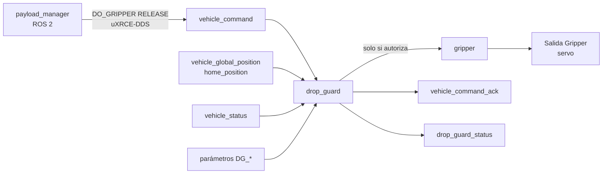
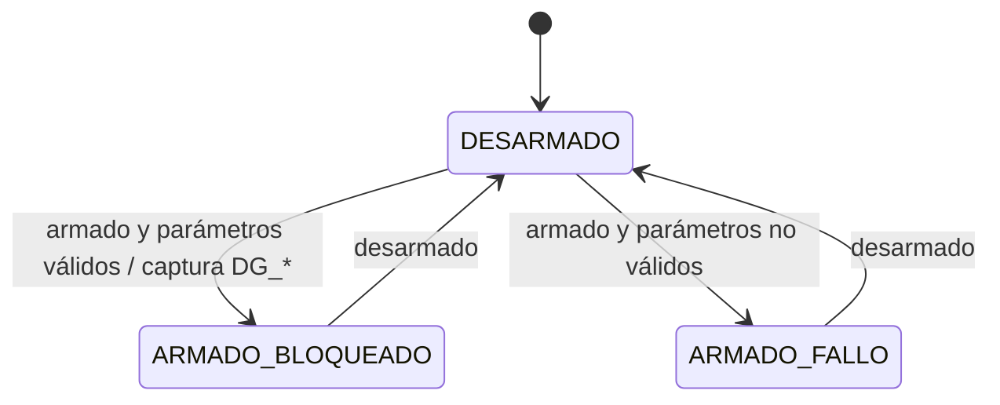

# drop\_guard: diseño del módulo PX4 (borrador v0.1)

Sep 25, 2026 · @Xabier

## 1. Propósito y enfoque

`drop_guard` sustituye al módulo `payload_deliverer` de PX4: recibe las órdenes de gripper y solo publica la de apertura si la aeronave está dentro de la zona de suelta. Es el segundo miembro, IDAL C, de la función de suelta (ADR-007).

**Requisitos asignados:** SR-FMS-007 completo; contribuye a SR-PLD-002 (doble condición) y a SR-PLD-003 (sin orden no hay apertura).

**Cómo encaja en PX4.** En PX4, `payload_deliverer` se suscribe a `vehicle_command`, atiende VEHICLE\_CMD\_DO\_GRIPPER (param2 = GRIPPER\_ACTION\_GRAB o GRIPPER\_ACTION\_RELEASE), responde con `vehicle_command_ack` y publica el tópico uORB `gripper` (COMMAND\_GRAB / COMMAND\_RELEASE), que llega al servo a través de la función de salida Gripper. Como uORB es publicación y suscripción, no se puede "interceptar" un mensaje; hay dos formas de meter el filtro:

| Opción | Qué se hace | Coste de mantener el fork |
| --- | --- | --- |
| A. Módulo nuevo que sustituye a payload\_deliverer | `drop_guard` atiende DO\_GRIPPER, decide y publica `gripper`; payload\_deliverer no se arranca | Bajo: solo se añade un directorio, un mensaje y la configuración de placa; no se toca código de PX4 |
| B. Parche en payload\_deliverer | payload\_deliverer consulta un tópico de autorización antes de soltar | Alto: hay que rehacer el parche en cada actualización de PX4 |

**Elegida: opción A.** El módulo reimplementa la parte mínima de payload\_deliverer (cerrar, abrir, confirmar) y deja fuera el resto (tiempos de espera y tipos de gripper que no usamos).



## 2. Interfaces

**Entradas uORB**

| Tópico | Campos usados | Para qué |
| --- | --- | --- |
| `vehicle_command` | command, param1 (instancia), param2 (acción), source\_system/component | Órdenes de gripper |
| `vehicle_global_position` | lat, lon, alt, eph, epv, timestamp, validez | Posición para la comprobación de zona |
| `home_position` | alt, valid\_alt | Altura relativa al punto de despegue |
| `vehicle_status` | arming\_state | Captura y bloqueo de parámetros al armar |
| `parameter_update` | — | Detecta cambios de parámetros |

**Salidas uORB**

| Tópico | Contenido |
| --- | --- |
| `gripper` | COMMAND\_GRAB siempre que se pida; COMMAND\_RELEASE solo si hay autorización |
| `vehicle_command_ack` | ACCEPTED al abrir o cerrar; DENIED con motivo si rechaza la apertura |
| `drop_guard_status` (nuevo) | Estado, autorización actual, motivo, distancia al centro, altura relativa, hash de la zona. A 5 Hz; se exporta a ROS 2 por uXRCE-DDS y va al ULog |

**Parámetros (fichero module.yaml del módulo)**

| Parámetro | Tipo | Unidad | Rango | Contenido |
| --- | --- | --- | --- | --- |
| DG\_ENABLE | booleano | — | 0–1 | 1 = filtro activo. Con 0 nunca se abre |
| DG\_LAT\_E7 | int | grados × 10⁷ | ±9·10⁸ | Centro de la zona |
| DG\_LON\_E7 | int | grados × 10⁷ | ±1,8·10⁹ | Centro de la zona |
| DG\_RADIUS | float | m | 1…100 | Radio de la zona (círculo en v1) |
| DG\_ALT\_MIN | float | m | 5…120 | Altura mínima de suelta sobre el despegue |
| DG\_ALT\_MAX | float | m | 5…120 | Altura máxima de suelta |
| DG\_EPH\_MAX | float | m | 0,5…10 | Incertidumbre horizontal máxima admitida |
| DG\_EPV\_MAX | float | m | 0,5…10 | Incertidumbre vertical máxima admitida |
| DG\_POS\_TOUT | int | ms | 50–1000 | Antigüedad máxima de la posición |
| DG\_ZONE\_HASH | int | — | — | Hash de la zona calculado por el MSN; se muestra al piloto en prevuelo |

**Nota sobre la precisión de float:** un float de 32 bits guardaría la latitud con resolución de unos 0,4 m en estas latitudes. Por eso latitud y longitud se guardan como enteros en grados × 10⁷ (resolución de 1 cm), igual que hace MAVLink.

## 3. Lógica de autorización

La apertura se autoriza solo si se cumplen todas las condiciones a la vez. La incertidumbre de la posición se resta del margen, así que una posición imprecisa encoge la zona en lugar de ampliarla.

```math
\text{autorizado} = E \land A \land P_{ok} \land F \land V \land (d + eph \le R) \land (h_{min} + epv \le h \le h_{max} - epv)
```

Donde E es DG\_ENABLE, A es armado con parámetros capturados y válidos, P\_ok es posición global válida con eph ≤ DG\_EPH\_MAX y epv ≤ DG\_EPV\_MAX, F es posición con antigüedad ≤ DG\_POS\_TOUT y V es altura del punto de despegue válida.

**Distancia al centro:** aproximación equirectangular en doble precisión, con φ y λ en radianes y R\_T = 6.371.000 m. Para distancias de menos de 1 km el error es despreciable frente a eph.

```math
x = (\lambda - \lambda_0)\cos\varphi_0 \, R_T, \quad y = (\varphi - \varphi_0)\, R_T, \quad d = \sqrt{x^2 + y^2}
```

**Altura relativa:** h = alt (global) − alt (home\_position).

**Motivos de rechazo** (en el ack, en `drop_guard_status` y en el log), en el orden en que se evalúan: DISABLED, NOT\_ARMED, PARAMS\_INVALID, POS\_STALE, POS\_INVALID, EPH\_HIGH, EPV\_HIGH, HOME\_INVALID, OUTSIDE\_RADIUS, BELOW\_BAND, ABOVE\_BAND. Se devuelve el primero que falla.

**Tratamiento de las órdenes**

| Orden recibida | Acción de drop\_guard | Ack |
| --- | --- | --- |
| DO\_GRIPPER GRAB | Publica COMMAND\_GRAB siempre | ACCEPTED |
| DO\_GRIPPER RELEASE, autorizado | Publica COMMAND\_RELEASE | ACCEPTED |
| DO\_GRIPPER RELEASE, no autorizado | No publica nada | DENIED, con el motivo en result\_param2 |
| DO\_GRIPPER con acción desconocida | No publica nada | DENIED |

La decisión se toma en el instante de la orden con los datos más recientes. La apertura es un evento único; no hace falta vigilar después.

**Máquina de estados**



En DESARMADO los parámetros se pueden cambiar y la apertura se deniega (NOT\_ARMED). En ARMADO\_FALLO la apertura se deniega siempre (PARAMS\_INVALID). Solo en ARMADO\_BLOQUEADO se evalúa la zona.

## 4. Bloqueo de parámetros y comportamiento ante fallos

PX4 no impide cambiar un parámetro con el dron armado, así que `drop_guard` captura una copia de DG\_\* al armar y usa solo esa copia hasta el desarmado. Cualquier fallo del propio módulo acaba en "no se abre".

**Validación al armar:** DG\_ALT\_MIN < DG\_ALT\_MAX, con una banda más ancha que 2 × DG\_EPV\_MAX (si no, quedaría vacía al recortarla y la suelta nunca se autorizaría); radio, límites de incertidumbre y latitud/longitud dentro de rango y finitos; y payload\_deliverer desactivado (PD\_GRIPPER\_EN = 0), para que no haya dos módulos atendiendo la misma orden.

| Situación | Comportamiento | Evidencia |
| --- | --- | --- |
| Cambio de DG\_\* con el dron armado | Se ignora; sigue valiendo la copia; se marca en el estado y se emite un evento | `drop_guard_status`, ULog |
| Posición antigua, no válida o con NaN | Deniega (POS\_STALE / POS\_INVALID) | Ack + estado |
| Incertidumbre alta (p. ej. GNSS degradado) | Deniega (EPH\_HIGH / EPV\_HIGH) | Ack + estado |
| DG\_ENABLE = 0 | Deniega siempre; el MSN bloquea el inicio de la misión al leer el estado | SR-MSN-002/003 |
| PD\_GRIPPER\_EN = 1 | ARMADO\_FALLO; el MSN bloquea el inicio de la misión | Estado |
| drop\_guard no arranca o se cuelga | Nadie publica COMMAND\_RELEASE: la carga queda retenida (SR-PLD-003); el MSN detecta la falta de `drop_guard_status` | health\_monitor |
| Arranque de la FMU | El servo queda en su valor de desarmado, configurado como cerrado | Configuración de salidas |

**Modo común conocido:** `drop_guard` y `payload_manager` usan la misma posición del EKF2. Una posición errónea pero declarada válida (FC-02) engañaría a los dos. Se trata en la CCA; la exigencia de eph y epv reduce, pero no elimina, esta exposición.

## 5. Estructura del código en el fork

La lógica de decisión va en una clase C++ pura, sin dependencias de PX4, para probarla con tests unitarios de forma aislada. La clase del módulo solo conecta uORB, parámetros y esa lógica.

| Fichero | Contenido |
| --- | --- |
| `src/modules/drop_guard/DropGuardLogic.hpp/.cpp` | Estructuras `Params`, `Inputs`, enum `Reason` y función `evaluate()`. Sin memoria dinámica, sin excepciones, sin cabeceras de PX4 |
| `src/modules/drop_guard/DropGuard.hpp/.cpp` | Módulo (ModuleBase + ScheduledWorkItem): suscripciones, captura de parámetros, publicación de `gripper`, ack y estado |
| `src/modules/drop_guard/module.yaml` | Definición de los parámetros DG\_\* |
| `src/modules/drop_guard/DropGuardLogicTest.cpp` | Tests unitarios (gtest, integrados en el build de PX4) |
| `src/modules/drop_guard/CMakeLists.txt`, `Kconfig` | Integración en el build |
| `msg/DropGuardStatus.msg` | Mensaje de estado nuevo |
| `src/modules/uxrce_dds_client/dds_topics.yaml` | Exporta `drop_guard_status` a ROS 2 |
| Configuración de placa (6C Mini y SITL) | Activa DROP\_GUARD y desactiva PAYLOAD\_DELIVERER |
| Script de arranque (ROMFS) | `drop_guard start` |

**Ejecución:** se despierta con cada `vehicle_command` y cada 200 ms para publicar el estado. Una evaluación son unas pocas operaciones en coma flotante: carga despreciable para la FMU.

**Estándar de código:** el de PX4 más el subconjunto MISRA C++ de los planes (§1) para `DropGuardLogic`, que es la parte de IDAL C.

## 6. Requisitos de ítem y verificación

Diez requisitos de ítem trazados sobre todo a SR-FMS-007 y SR-PLD-003 (y dos a SR-PLD-004 y SR-MSN-010). Todos se verifican con tests unitarios de la lógica y, los de comportamiento, también en SITL.

| ID | Requisito | Padre | Verificación |
| --- | --- | --- | --- |
| IR-DG-001 | drop\_guard publicará COMMAND\_RELEASE solo si `evaluate()` devuelve autorizado en el instante de la orden. | SR-FMS-007 | Test unitario + SIM-06 |
| IR-DG-002 | drop\_guard publicará COMMAND\_GRAB ante cualquier orden de cierre. | SR-PLD-003 | Test unitario |
| IR-DG-003 | La distancia al centro más eph no superará DG\_RADIUS para autorizar. | SR-FMS-007 | Test unitario (límites) |
| IR-DG-004 | La altura relativa estará entre DG\_ALT\_MIN + epv y DG\_ALT\_MAX − epv para autorizar. | SR-FMS-007 | Test unitario (límites) |
| IR-DG-005 | Una posición no válida, con valores no finitos o más antigua que DG\_POS\_TOUT denegará la apertura. | SR-FMS-007 | Test unitario + SIM-22 |
| IR-DG-006 | drop\_guard capturará DG\_\* al armar e ignorará sus cambios hasta el desarmado. | SR-FMS-007 | Test unitario + SIM-21 |
| IR-DG-007 | Unos parámetros no válidos al armar, o PD\_GRIPPER\_EN = 1, dejarán el módulo en ARMADO\_FALLO. | SR-FMS-007 | Test unitario |
| IR-DG-008 | Cada rechazo se confirmará con DENIED y el motivo en result\_param2. | SR-PLD-004 | Test unitario + SIM-06 |
| IR-DG-009 | drop\_guard publicará `drop_guard_status` al menos a 5 Hz. | SR-MSN-010 (vigilancia) | SITL |
| IR-DG-010 | Sin autorización explícita no se publicará ninguna orden de apertura, incluido el arranque. | SR-PLD-003 | Revisión de código + SITL |

**Casos de test unitario mínimos:** justo en el borde del radio con eph = 0 y con eph > 0; bordes inferior y superior de la banda de altura; latitud NaN; posición caducada por 1 ms; home no válido; DG\_ALT\_MIN ≥ DG\_ALT\_MAX; cambio de parámetro con el dron armado; zona cruzando el meridiano 0 (Toulouse está cerca) y longitud negativa (Donostia).

**Cobertura:** 100 % de sentencias (exigencia de IDAL C) y objetivo de 100 % de decisiones en `DropGuardLogic`, medido en CI.

**Escenarios nuevos para DOC-10:** SIM-21, cambio de DG\_\* en vuelo: la zona original sigue vigente. SIM-22, degradación del GNSS al llegar a la zona: suelta denegada con EPH\_HIGH.

**Estado de la implementación (25/09/2026):** `DropGuardLogic` implementada en C++17 con 38 tests unitarios. Todos pasan, con 100 % de sentencias (104/104), ramas (142/142) y decisiones (36/36), sin errores con AddressSanitizer y UBSan, y sin avisos con `-Wall -Wextra -Wpedantic -Werror -Wconversion -Wfloat-equal`. Cubre IR-DG-003 a IR-DG-007 a nivel de lógica. Pendiente: el módulo `DropGuard` que la conecta con uORB (IR-DG-001, 002, 008, 009, 010) y los escenarios SITL.

**Módulo DropGuard implementado sobre PX4 v1.17.0 (25/09/2026).** Parche de 15 ficheros que aplica limpio sobre la etiqueta. Compila sin avisos en SITL. Prueba de integración en SITL con SIH (6 casos, 4 ejecuciones): 23/24 comprobaciones correctas. El único fallo fue un COMMAND\_ACK que no llegó al script de prueba, aunque el log confirma que drop\_guard autorizó; no se repitió. Por eso `payload_manager` debe confirmar la suelta con `drop_guard_status` y el sensor de carga, no solo con el ack.

**Hallazgos en el código de PX4 v1.17 que cambian el diseño:**

- `FunctionGripper` arranca con el valor de "abierto" hasta recibir el primer mensaje `gripper`. Nuevo requisito IR-DG-011: drop\_guard publica COMMAND\_GRAB al arrancar y en cada armado.
- `PD_GRIPPER_EN` no existe: payload\_deliverer se arranca siempre si está compilado. La exclusión se hace en compilación (Kconfig `depends on !MODULES_PAYLOAD_DELIVERER` y un `#error`), y el script de arranque llama a `drop_guard start`.
- commander ignora DO\_GRIPPER y navigator no espera el ack, así que no hay respuestas en conflicto.
- El `px4_msgs` oficial no incluye DropGuardStatus: el workspace ROS 2 debe generar `px4_msgs` desde el `msg/` del fork.

## 7. Puntos abiertos

- [ ] Comprobar que, con payload\_deliverer desactivado, la función de salida Gripper sigue atendiendo el tópico `gripper` publicado por otro módulo.
- [ ] Comprobar cómo trata commander un VEHICLE\_CMD\_DO\_GRIPPER (que no responda "no soportado" en paralelo al ack de drop\_guard).
- [ ] Fijar los valores de DG\_EPH\_MAX y DG\_EPV\_MAX con datos del M10 en vuelo (el umbral de precisión pendiente en el ICD).
- [ ] Decidir el algoritmo de DG\_ZONE\_HASH (p. ej. CRC32 de los parámetros de la zona) y dónde lo ve el piloto en QGroundControl.
- [ ] Polígono en lugar de círculo en una versión posterior, si las zonas de suelta reales lo piden.
